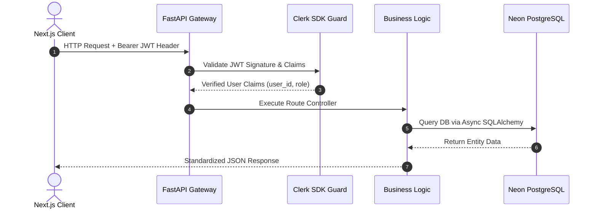

# REST API Architecture Specification (`API_SPEC.md`)
## AI-Powered Personalized Gift Recommendation Platform ("Presently")

---

## 1. API Architecture Overview

### 1.1 Base URL & Versioning
* **Base URL**: `https://api.presently.app/api/v1` (Production) / `http://localhost:8000/api/v1` (Development)
* **Versioning Policy**: Explicit URI path versioning (`/api/v1`). Breaking changes will spawn `/api/v2`.

### 1.2 Authentication & Request Lifecycle
All protected endpoints require a valid **Clerk Authentication Bearer Token** in the HTTP request header:
`Authorization: Bearer <clerk_session_jwt>`



### 1.3 Standard Response & Error Envelope
All non-streaming responses strictly follow standard JSON wrappers.

#### Success Response Envelope (HTTP 200/201)
```json
{
  "success": true,
  "data": { ... },
  "message": "Operation completed successfully",
  "meta": {
    "timestamp": "2026-08-07T00:45:00Z",
    "request_id": "req_8f9a2b3c4d5e"
  }
}
```

#### Error Response Envelope (HTTP 4xx/5xx)
```json
{
  "success": false,
  "error": {
    "code": "RESOURCE_NOT_FOUND",
    "message": "The requested recipient profile does not exist or has been deleted.",
    "details": [
      {
        "field": "recipient_id",
        "issue": "UUID '9b1deb4d-3b7d-4bad-9bdd-2b0d7b3dcb6d' not found in database."
      }
    ]
  },
  "meta": {
    "timestamp": "2026-08-07T00:45:00Z",
    "request_id": "req_8f9a2b3c4d5e"
  }
}
```

---

## 2. Authentication & User Management Endpoints

### 2.1 `GET /api/v1/auth/me`
* **Summary**: Retrieve currently authenticated user profile and permissions.
* **Auth**: Required (`Bearer JWT`).
* **Response (200 OK)**:
```json
{
  "success": true,
  "data": {
    "id": "e4a2c01d-56e1-4567-89ab-cdef01234567",
    "clerk_id": "user_2N3xQ9L0zWvKjM8P1R4T7V9Y",
    "email": "alex.dev@presently.app",
    "username": "alex_dev",
    "role": "registered_user",
    "profile": {
      "full_name": "Alex Mercer",
      "avatar_url": "https://res.cloudinary.com/presently/image/upload/v1/avatars/alex.jpg",
      "preferred_currency": "USD",
      "theme_preference": "dark"
    }
  }
}
```

### 2.2 `POST /api/v1/auth/sync`
* **Summary**: Clerk Webhook handler for user synchronization (`user.created`, `user.updated`).
* **Auth**: Clerk Webhook Signature verification (`Svix-Signature`).

---

## 3. Survey & AI Recommendation Endpoints

### 3.1 `POST /api/v1/recommendations/generate`
* **Summary**: Stream AI gift recommendations real-time over Server-Sent Events (SSE) or JSON payload.
* **Auth**: Required (Guest fallback allows 1 demo run / IP).
* **Request Body**:
```json
{
  "recipient": {
    "name": "Sarah",
    "relationship": "Partner",
    "age": 29,
    "gender": "Female"
  },
  "occasion": "Anniversary",
  "budget": {
    "min": 50,
    "max": 150,
    "currency": "USD"
  },
  "personality": {
    "traits": ["Creative", "Introverted", "Coffee Enthusiast"],
    "taste_style": "Minimalist",
    "practicality_preference": "Balanced"
  },
  "hobbies": ["Specialty Coffee", "Vintage Photography"],
  "memories_and_notes": "Loves dark roast Ethiopian beans. Has a Leica film camera."
}
```

* **Response (200 OK - SSE Stream / Chunk Format)**:
```json
{
  "recommendation_id": "9b1deb4d-3b7d-4bad-9bdd-2b0d7b3dcb6d",
  "status": "streaming",
  "item": {
    "id": "e4a2c01d-56e1-4567-89ab-cdef01234567",
    "title": "Fellow Stagg EKG Electric Gooseneck Kettle",
    "estimated_price": 165.00,
    "category": "Home & Kitchen",
    "match_score": 96,
    "strategy_label": "Top Quality Essential",
    "ai_reasoning": "Sarah's passion for specialty coffee brewing aligns perfectly with precision pour-over temperature control. The sleek minimalist aesthetic matches her design taste.",
    "affiliate_url": "https://presently.app/out/fellow-kettle-123",
    "image_url": "https://res.cloudinary.com/presently/image/upload/v1/products/kettle.jpg"
  }
}
```

---

## 4. Gift Catalog & Search Endpoints

### 4.1 `GET /api/v1/gifts`
* **Summary**: Query paginated gift catalog.
* **Query Parameters**:
  * `category` (string, optional): e.g. `tech`
  * `min_price` (numeric, optional): e.g. `20`
  * `max_price` (numeric, optional): e.g. `100`
  * `page` (int, default `1`)
  * `limit` (int, default `20`)
* **Response (200 OK)**: Paginated array of gift items.

### 4.2 `GET /api/v1/search`
* **Summary**: Global vector & text search across gifts, community posts, and categories.
* **Query Parameters**: `q` (string, required), `type` (`all|gifts|community`), `page`, `limit`.

---

## 5. Community & Social Endpoints

### 5.1 `GET /api/v1/community/posts`
* **Summary**: Fetch infinite scroll community unboxing feed.
* **Query Parameters**: `category` (string), `sort` (`trending|latest`), `page`, `limit`.

### 5.2 `POST /api/v1/community/posts`
* **Summary**: Publish a new gift story.
* **Request Body**:
```json
{
  "title": "Unboxing the Ultimate Mechanical Keyboard for my Husband",
  "content": "He spends 8 hours typing every day. The Keychron Q1 was a massive hit!",
  "gift_item_id": "e4a2c01d-56e1-4567-89ab-cdef01234567",
  "image_urls": ["https://res.cloudinary.com/presently/image/upload/v1/posts/kb1.jpg"]
}
```

### 5.3 `POST /api/v1/community/posts/{id}/like`
* **Summary**: Toggle upvote on a community post.

---

## 6. Wishlist & Recipient Vault Endpoints

### 6.1 `GET /api/v1/recipients`
* **Summary**: List all saved recipient profiles for current user.

### 6.2 `POST /api/v1/wishlists`
* **Summary**: Create a new custom gift collection folder.

---

## 7. Cloudinary Direct Upload Signed Endpoint

### 7.1 `POST /api/v1/uploads/signature`
* **Summary**: Generate pre-signed security parameters for frontend direct Cloudinary upload.
* **Request Body**: `{"folder": "community_posts"}`
* **Response (200 OK)**: `{"signature": "...", "timestamp": 1754527500, "api_key": "..."}`

---

## 8. Complete Error Catalog

| HTTP Status | Internal Code | Description | Client Action |
|---|---|---|---|
| 400 | `VALIDATION_ERROR` | Pydantic payload validation failure | Highlight invalid form fields |
| 401 | `AUTH_UNAUTHORIZED` | Missing or expired Clerk JWT | Redirect to `/login` |
| 403 | `FORBIDDEN_ACTION` | Insufficient RBAC role permissions | Display access denied alert |
| 404 | `RESOURCE_NOT_FOUND` | Target entity UUID missing | Show 404 empty state |
| 429 | `RATE_LIMIT_EXCEEDED` | Exceeded 10 requests / min threshold | Show retry countdown timer |
| 502 | `AI_PROVIDER_TIMEOUT` | OpenAI API response timeout | Trigger secondary model fallback |

---

## 9. FastAPI Codebase Folder Architecture

```
backend/
├── app/
│   ├── api/
│   │   ├── v1/
│   │   │   ├── endpoints/
│   │   │   │   ├── auth.py
│   │   │   │   ├── users.py
│   │   │   │   ├── surveys.py
│   │   │   │   ├── recommendations.py
│   │   │   │   ├── gifts.py
│   │   │   │   ├── community.py
│   │   │   │   ├── wishlists.py
│   │   │   │   └── admin.py
│   │   │   └── api_router.py
│   ├── core/
│   │   ├── config.py          # Pydantic BaseSettings
│   │   ├── security.py        # Clerk JWT validation dependencies
│   │   └── openai_client.py   # OpenAI Async client & prompt templates
│   ├── db/
│   │   ├── base.py            # SQLAlchemy Base
│   │   └── session.py         # Neon Async Session Generator
│   ├── models/                # SQLAlchemy Async Models
│   ├── schemas/               # Pydantic V2 Response & Request Schemas
│   └── services/              # Core Business Logic Layer
├── alembic/                   # Database Migration Scripts
├── main.py                    # FastAPI App Initialization & Middleware
└── requirements.txt
```

---

## 10. OpenAPI & Swagger Interactive Documentation

* **Interactive Swagger UI**: `https://api.presently.app/docs`
* **ReDoc Interface**: `https://api.presently.app/redoc`
* **OpenAPI JSON Spec**: `https://api.presently.app/openapi.json`

---

## 11. Deliverable Handover Statement

This REST API Architecture Specification (`API_SPEC.md`) provides complete route signatures, Pydantic schemas, HTTP status codes, and folder structures ready for immediate FastAPI backend and Next.js frontend implementation.
