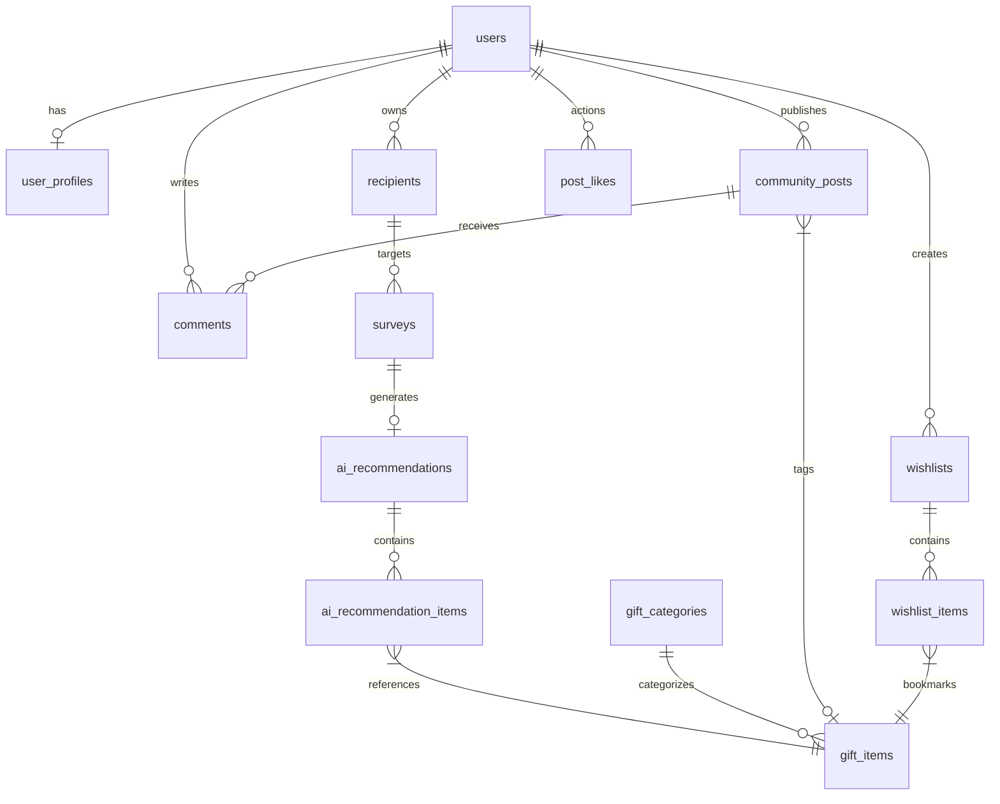

# Database Schema Architecture (`DATABASE_SCHEMA.md`)
## AI-Powered Personalized Gift Recommendation Platform ("Presently")

---

## 1. Database Overview & Architectural Strategy

### 1.1 Technology Selection Rationale: PostgreSQL on Neon Serverless
`Presently` relies on **PostgreSQL 16+** deployed via **Neon Serverless PostgreSQL**. Key factors driving this choice:
* **JSONB & Hybrid Vector Capabilities**: Combines structured relational querying with semi-structured JSONB payloads for survey responses and `pgvector` for embedding similarity search.
* **Serverless Auto-Scaling & Branching**: Instant copy-on-write database branching for isolation testing and zero-downtime migrations via Alembic.
* **Strict ACID Compliance & Relational Integrity**: Prevents orphan entities in multi-table social & wishlist operations.

### 1.2 Global Database Conventions
* **Naming Standard**: `snake_case` for all table names, column names, indexes, and constraints. Plural table names (e.g. `users`, `gift_items`).
* **Primary Key Strategy**: UUID v4 / UUID v7 generated via `gen_random_uuid()` for all entities, preventing auto-increment enumeration vectors.
* **Timestamp Standards**: All timestamp fields use `TIMESTAMPTZ` stored strictly in UTC. Automatic triggers update `updated_at`.
* **Soft Delete Strategy**: Critical entities (`users`, `community_posts`, `gift_items`) implement soft deletion using `deleted_at TIMESTAMPTZ NULL`. Queries default to `WHERE deleted_at IS NULL`.
* **Audit Strategy**: Every row tracks `created_at` and `updated_at`. Financial, administrative, and AI generation operations write immutable entries to `audit_logs` and `ai_prompt_logs`.

---

## 2. Comprehensive Entity Registry

| Entity Module | Tables Belonging to Module | Description |
|---|---|---|
| **Identity & Access** | `users`, `user_profiles`, `roles`, `permissions`, `user_roles` | Clerk webhook sync, profile settings, RBAC roles. |
| **Gift Catalog** | `gift_items`, `gift_categories`, `gift_tags`, `gift_item_tags`, `gift_images`, `gift_reviews` | Canonical product catalog, merchant links, user ratings. |
| **Survey & AI Engine**| `recipients`, `surveys`, `survey_questions`, `survey_answers`, `ai_recommendations`, `ai_recommendation_items`, `ai_conversations`, `ai_messages` | Recipient profiles, survey inputs, LLM stream outputs. |
| **Community & Social** | `community_posts`, `post_images`, `comments`, `post_likes`, `saved_posts`, `reports` | User-generated unwrapping stories, upvotes, moderation. |
| **Wishlist Vault** | `wishlists`, `wishlist_items` | Custom user gift collections. |
| **Notifications & Log**| `notifications`, `notification_preferences`, `search_history`, `audit_logs`, `system_settings` | System alerts, search analytics, admin audit log. |

---

## 3. Detailed Table Design & Schema Specifications

### 3.1 Module 1: Identity & User Profiles

#### Table: `users`
Stores core user identities synchronized from Clerk Authentication webhooks.

| Column | Data Type | Constraints | Default | Description |
|---|---|---|---|---|
| `id` | UUID | Primary Key | `gen_random_uuid()` | Internal system user identifier |
| `clerk_id` | VARCHAR(255) | Unique, Not Null, Index | None | Clerk external auth identifier |
| `email` | VARCHAR(255) | Unique, Not Null, Index | None | User primary email address |
| `username` | VARCHAR(50) | Unique, Not Null, Index | None | Public handle `@username` |
| `is_active` | BOOLEAN | Not Null | `true` | Account active flag |
| `deleted_at` | TIMESTAMPTZ | Nullable, Index | `NULL` | Soft deletion timestamp |
| `created_at` | TIMESTAMPTZ | Not Null | `NOW()` | Registration timestamp |
| `updated_at` | TIMESTAMPTZ | Not Null | `NOW()` | Profile last updated timestamp |

* **Check Constraints**: `CONSTRAINT chk_email_format CHECK (email ~* '^[A-Za-z0-9._%+-]+@[A-Za-z0-9.-]+\.[A-Za-z]{2,}$')`

#### Table: `user_profiles`
Extended profile information and visual assets.

| Column | Data Type | Constraints | Default | Description |
|---|---|---|---|---|
| `id` | UUID | Primary Key | `gen_random_uuid()` | Profile identifier |
| `user_id` | UUID | FK -> `users.id` ON DELETE CASCADE, Unique | None | Foreign key relation to user |
| `full_name` | VARCHAR(255) | Nullable | `NULL` | User display full name |
| `avatar_url` | TEXT | Nullable | `NULL` | Cloudinary avatar URL |
| `bio` | TEXT | Nullable | `NULL` | User bio description |
| `preferred_currency` | VARCHAR(3) | Not Null | `'USD'` | Default display currency |
| `theme_preference` | VARCHAR(20) | Not Null | `'system'` | Light / Dark / System |
| `created_at` | TIMESTAMPTZ | Not Null | `NOW()` | Timestamp |

---

### 3.2 Module 2: Gift Catalog System

#### Table: `gift_items`
Canonical product catalog of gift ideas.

| Column | Data Type | Constraints | Default | Description |
|---|---|---|---|---|
| `id` | UUID | Primary Key | `gen_random_uuid()` | Gift item identifier |
| `title` | VARCHAR(255) | Not Null, Index | None | Product title |
| `slug` | VARCHAR(255) | Unique, Not Null | None | SEO friendly URL slug |
| `description` | TEXT | Not Null | None | Comprehensive product summary |
| `estimated_price` | NUMERIC(10, 2) | Not Null, Index | None | Price in USD |
| `category_id` | UUID | FK -> `gift_categories.id` ON DELETE RESTRICT | None | Primary category classification |
| `affiliate_url` | TEXT | Not Null | None | Outbound vendor buy link |
| `merchant_name` | VARCHAR(100) | Not Null, Index | `'Amazon'` | Vendor name |
| `primary_image_url`| TEXT | Not Null | None | Cloudinary main image asset |
| `is_verified` | BOOLEAN | Not Null | `true` | Quality verification check |
| `rating_avg` | NUMERIC(3, 2) | Not Null | `0.00` | Aggregated user rating |
| `rating_count` | INTEGER | Not Null | `0` | Total review count |
| `deleted_at` | TIMESTAMPTZ | Nullable, Index | `NULL` | Soft delete marker |

* **Check Constraints**: `CONSTRAINT chk_gift_price_positive CHECK (estimated_price >= 0.00)`

#### Table: `gift_categories`
Taxonomy tree for catalog organization.

| Column | Data Type | Constraints | Default | Description |
|---|---|---|---|---|
| `id` | UUID | Primary Key | `gen_random_uuid()` | Category identifier |
| `name` | VARCHAR(100) | Unique, Not Null | None | Display category title |
| `slug` | VARCHAR(100) | Unique, Not Null | None | URL slug |
| `parent_id` | UUID | FK -> `gift_categories.id` ON DELETE SET NULL | `NULL` | Self-referencing parent category |

---

### 3.3 Module 3: Survey & AI Recommendation Engine

#### Table: `recipients`
Saved recipient profiles owned by users.

| Column | Data Type | Constraints | Default | Description |
|---|---|---|---|---|
| `id` | UUID | Primary Key | `gen_random_uuid()` | Recipient identifier |
| `user_id` | UUID | FK -> `users.id` ON DELETE CASCADE, Index | None | Owner user ID |
| `name` | VARCHAR(255) | Not Null | None | Recipient name or nickname |
| `relationship` | VARCHAR(100) | Not Null, Index | None | Relationship tag |
| `birth_date` | DATE | Nullable | `NULL` | Birthday for notification triggers |
| `gender` | VARCHAR(50) | Nullable | `NULL` | Optional gender identity |
| `notes` | TEXT | Nullable | `NULL` | Private gifter memory notes |
| `created_at` | TIMESTAMPTZ | Not Null | `NOW()` | Timestamp |

#### Table: `surveys`
Captured parameters submitted to the AI engine.

| Column | Data Type | Constraints | Default | Description |
|---|---|---|---|---|
| `id` | UUID | Primary Key | `gen_random_uuid()` | Survey execution identifier |
| `user_id` | UUID | FK -> `users.id` ON DELETE SET NULL, Nullable | `NULL` | User reference (Null for guests) |
| `recipient_id` | UUID | FK -> `recipients.id` ON DELETE SET NULL, Nullable | `NULL` | Linked saved recipient |
| `occasion` | VARCHAR(100) | Not Null, Index | None | Target occasion |
| `min_budget` | NUMERIC(10, 2) | Not Null | None | Lower budget limit |
| `max_budget` | NUMERIC(10, 2) | Not Null | None | Upper budget limit |
| `survey_payload` | JSONB | Not Null | None | Complete JSON parameters |
| `created_at` | TIMESTAMPTZ | Not Null | `NOW()` | Execution timestamp |

#### Table: `ai_recommendations`
Output sessions generated by the OpenAI LLM.

| Column | Data Type | Constraints | Default | Description |
|---|---|---|---|---|
| `id` | UUID | Primary Key | `gen_random_uuid()` | Recommendation session ID |
| `survey_id` | UUID | FK -> `surveys.id` ON DELETE CASCADE, Unique | None | Originating survey |
| `ai_model_used` | VARCHAR(50) | Not Null | `'gpt-4o'` | Model version identifier |
| `prompt_tokens` | INTEGER | Not Null | `0` | Telemetry token metric |
| `completion_tokens`| INTEGER | Not Null | `0` | Telemetry token metric |
| `execution_time_ms`| INTEGER | Not Null | `0` | Response latency in ms |
| `created_at` | TIMESTAMPTZ | Not Null | `NOW()` | Generation timestamp |

#### Table: `ai_recommendation_items`
Junction linking gift items to a recommendation session with custom AI rationale.

| Column | Data Type | Constraints | Default | Description |
|---|---|---|---|---|
| `id` | UUID | Primary Key | `gen_random_uuid()` | Entry ID |
| `recommendation_id` | UUID | FK -> `ai_recommendations.id` ON DELETE CASCADE | None | Parent recommendation session |
| `gift_item_id` | UUID | FK -> `gift_items.id` ON DELETE CASCADE | None | Target gift product |
| `match_score` | INTEGER | Not Null | None | Calculated match % (0-100) |
| `strategy_label` | VARCHAR(100) | Not Null | None | Strategy tag (e.g. Sentimental Pick) |
| `ai_reasoning` | TEXT | Not Null | None | Custom rationale generated by LLM |

---

### 3.4 Module 4: Community & Social Network

#### Table: `community_posts`
User-shared gift stories and unboxing experiences.

| Column | Data Type | Constraints | Default | Description |
|---|---|---|---|---|
| `id` | UUID | Primary Key | `gen_random_uuid()` | Post identifier |
| `user_id` | UUID | FK -> `users.id` ON DELETE CASCADE, Index | None | Author user ID |
| `title` | VARCHAR(255) | Not Null | None | Story headline |
| `content` | TEXT | Not Null | None | Markdown content body |
| `gift_item_id` | UUID | FK -> `gift_items.id` ON DELETE SET NULL, Nullable | `NULL` | Tagged product catalog item |
| `likes_count` | INTEGER | Not Null | `0` | Aggregated like counter |
| `comments_count` | INTEGER | Not Null | `0` | Aggregated comment counter |
| `is_published` | BOOLEAN | Not Null | `true` | Publication status flag |
| `deleted_at` | TIMESTAMPTZ | Nullable, Index | `NULL` | Soft delete timestamp |
| `created_at` | TIMESTAMPTZ | Not Null | `NOW()` | Timestamp |

#### Table: `comments` & `post_likes`
Nested social responses and upvotes.

---

## 4. Entity Relationship Diagram (ERD)



---

## 5. Indexing Architecture & Performance Tuning

```sql
-- 1. Fast User & Authentication Lookups
CREATE UNIQUE INDEX idx_users_clerk_id ON users(clerk_id);
CREATE UNIQUE INDEX idx_users_email ON users(email);

-- 2. Gift Catalog Filtering (Category + Price + Soft Delete)
CREATE INDEX idx_gift_items_cat_price ON gift_items(category_id, estimated_price) WHERE deleted_at IS NULL;
CREATE INDEX idx_gift_items_search ON gift_items USING gin(to_tsvector('english', title || ' ' || description));

-- 3. Community Feed Pagination Indexing (Created At + Soft Delete)
CREATE INDEX idx_community_posts_feed ON community_posts(created_at DESC) WHERE deleted_at IS NULL;

-- 4. Recipient Birthday Reminders
CREATE INDEX idx_recipients_birth_date ON recipients(birth_date) WHERE birth_date IS NOT NULL;
```

---

## 6. Security & Data Protection (GDPR / Encryption)

1. **Row-Level Security (RLS)**: Enforced via PostgreSQL policies ensuring users can only read/write their own `recipients`, `surveys`, and `wishlists`.
2. **Encrypted Storage**: Sensitive recipient survey notes (`recipients.notes`) encrypted using `pgcrypto` AES-256 before disk persistence.
3. **Clerk Authentication Guarantee**: Direct database access relies on validated JWT tokens passed from FastAPI dependencies.

---

## 7. Migration Lifecycle & Alembic Blueprint

```bash
# Alembic Migration Command Sequence
alembic revision --autogenerate -m "create_initial_presently_schema"
alembic upgrade head
```

---

## 8. Sample Records Matrix

#### Sample Record: `users`
```json
{
  "id": "e4a2c01d-56e1-4567-89ab-cdef01234567",
  "clerk_id": "user_2N3xQ9L0zWvKjM8P1R4T7V9Y",
  "email": "alex.dev@presently.app",
  "username": "alex_dev",
  "is_active": true,
  "created_at": "2026-08-07T00:00:00Z"
}
```

#### Sample Record: `ai_recommendation_items`
```json
{
  "id": "9b1deb4d-3b7d-4bad-9bdd-2b0d7b3dcb6d",
  "recommendation_id": "7c8e9f0a-1b2c-3d4e-5f6a-7b8c9d0e1f2a",
  "gift_item_id": "f5b3d12e-67a8-90bc-def1-234567890abc",
  "match_score": 96,
  "strategy_label": "Top Quality Essential",
  "ai_reasoning": "Fits Alex's daily pour-over coffee ritual perfectly."
}
```

---

## 9. Deliverable Handover Statement

This Database Schema Architecture (`DATABASE_SCHEMA.md`) provides complete SQL specifications, indexing policies, and sample records ready for immediate SQLAlchemy ORM implementation and Alembic migration generation.
