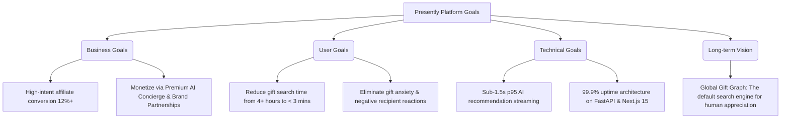
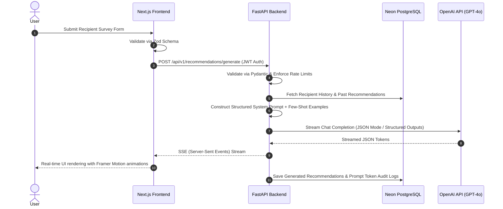
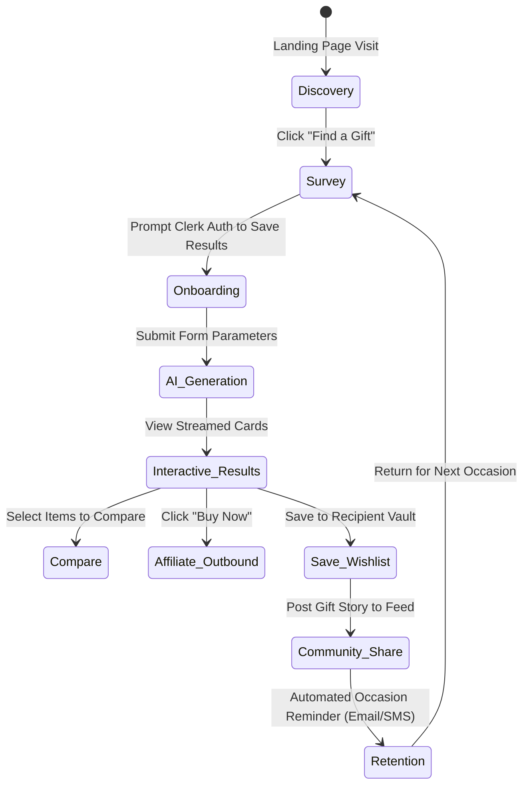
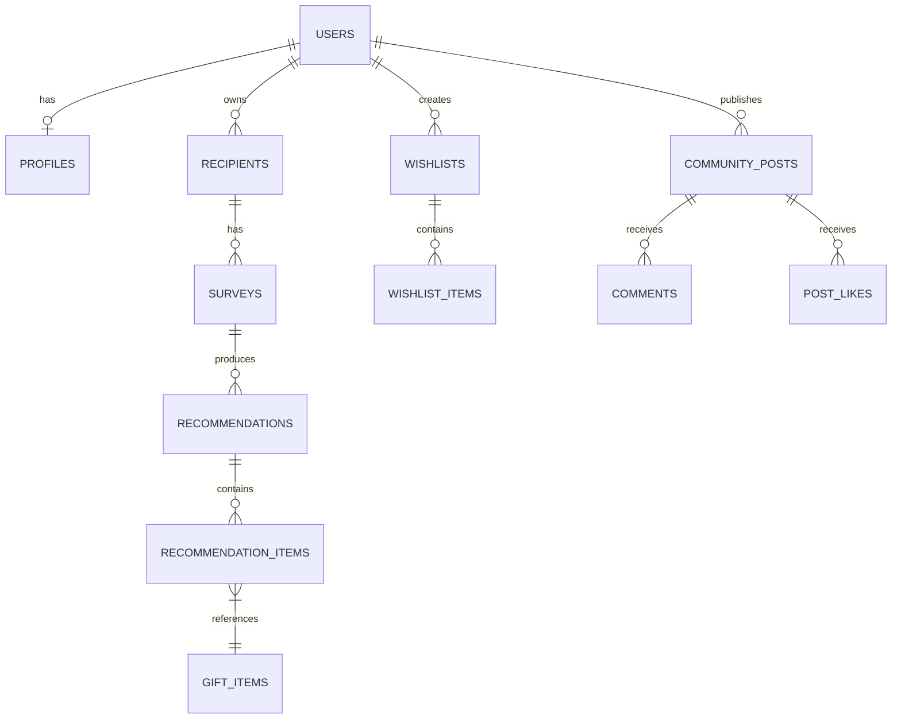
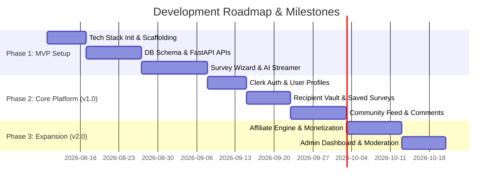

# Product Requirements Document (PRD)
## AI-Powered Personalized Gift Recommendation & Community Platform

---

## 1. Executive Summary & Brand Identity

### 1.1 Overview
The AI Gift Recommendation Platform is a startup-grade web application designed to eliminate the anxiety and guesswork of gift-giving. By combining deep context-aware artificial intelligence with real-world community insights, the platform delivers hyper-personalized, thoughtful gift recommendations tailored to specific relationships, personalities, budgets, and occasions. 

### 1.2 Brand Name Candidates
Below are 20 premium, memorable brand name candidates designed for a global audience, evaluated against modern naming paradigms (similar to *Linear, Notion, Stripe, Airbnb, Spotify, Apple*).

| # | Proposed Name | Phonetics | Rationale & Brand Fit | Potential Domain Concept |
|---|---|---|---|---|
| 1 | **Presently** | `/ˈprɛzəntli/` | Clean, double-meaning ("gifts" + "at this moment"). Evokes real-time AI delivery of thoughtful presents. | `presently.app` / `getpresently.com` |
| 2 | **Gifty** | `/ˈɡɪfti/` | Friendly, approachable, consumer-focused. Highly memorable for quick consumer mindshare. | `gifty.ai` / `usegifty.com` |
| 3 | **Thoughtful** | `/ˈθɔːtfʊl/` | Emotional, premium, directly reflects the core user goal of giving meaningful gifts. | `thoughtful.ai` / `thoughtfulgift.com` |
| 4 | **Unwrap** | `/ʌnˈræp/` | Action-oriented, experiential. Captures the joy of discovery and unboxing. | `unwrap.app` / `unwrap.ai` |
| 5 | **Kith** | `/kɪθ/` | Old English for "one's friends and acquaintances". Minimalist, warm, ultra-modern. | `kith.ai` / `kithgifts.com` |
| 6 | **Curate** | `/kjʊəˈreɪt/` | Professional, high-end editorial feel. Implies precise selection rather than generic algorithms. | `curate.ai` / `curateapp.io` |
| 7 | **Bespoke** | `/bɪˈspoʊk/` | Luxury connotation. Emphasizes hyper-personalization over off-the-shelf suggestions. | `bespoke.ai` / `getbespoke.app` |
| 8 | **AuraGifts** | `/ˈɔːrə ɡɪfts/` | Modern, atmospheric. Suggests matching a gift to the recipient's personal vibe and personality. | `auragifts.com` / `auragifts.ai` |
| 9 | **Kinship** | `/ˈkɪnʃɪp/` | Emphasizes relationships, bonding, and appreciation of family and close friends. | `kinship.ai` / `kinshipgifts.com` |
| 10 | **Nectar** | `/ˈnɛktər/` | Sweet, delightful, rare. Short, iconic consumer brand name in the style of Apple/Notion. | `nectargifts.com` / `nectar.ai` |
| 11 | **Veritas** | `/ˈvɛrɪtæs/` | Premium, precise. Connotes truth in understanding what a recipient truly desires. | `veritasgift.com` / `veritas.ai` |
| 12 | **Givv** | `/ɡɪv/` | Playful double-v spelling of "give". Short, tech-first brandable vector. | `givv.ai` / `givv.app` |
| 13 | **Glimmer** | `/ˈɡlɪmər/` | Sparks joy, magic, and inspiration. Warm, visually suggestive brand identity. | `glimmer.ai` / `useglimmer.com` |
| 14 | **Favora** | `/fəˈvɔːrə/` | Soft, elegant, globally recognizable root word for "favorites" and "favors". | `favora.ai` / `favora.app` |
| 15 | **Foundry** | `/ˈfaʊndri/` | Industrial craft aesthetic. Suggests forging ideal gift ideas from raw personality traits. | `giftfoundry.ai` / `foundrygifts.com` |
| 16 | **Affinity** | `/əˈfɪnɪti/` | Mathematical & emotional match. Highlights matching recipient traits to perfect gifts. | `affinitygift.com` / `affinity.ai` |
| 17 | **Lumina** | `/ˈluːmɪnə/` | Illuminating the dark process of gift searching with AI intelligence. | `luminagifts.com` / `lumina.ai` |
| 18 | **Cherish** | `/ˈtʃɛrɪʃ/` | Emotional resonance. Focuses on sentimentality and lasting memorable experiences. | `cherish.ai` / `getcherish.com` |
| 19 | **Savant** | `/sæˈvɑːnt/` | Positioning the AI as an expert concierge with deep intelligence and taste. | `giftsavant.com` / `savant.ai` |
| 20 | **Kudos** | `/ˈkjuːdɒs/` | Celebration, praise, appreciation. Expressing gratitude through seamless gift giving. | `kudosgifts.com` / `kudos.ai` |

> **Recommended Primary Brand Name**: **Presently** (Working Title)

---

## 2. Core Project Vision & Strategic Goals

### 2.1 Project Idea Summary
`Presently` is a dual-engine gift platform:
1. **AI Intelligence Engine**: Analyzes granular recipient profiles (relationship dynamics, hobbies, taste preferences, memory markers, budget constraints, aesthetic profiles) to generate reasoned, ranked recommendations.
2. **Social Knowledge Graph**: A community platform where verified gifters share successful real-world gifting experiences, curated collections, and feedback.

### 2.2 Goals Framework



#### 2.2.1 Business Goals
* **Affiliate Revenue Conversion**: Achieve >12% click-through rate (CTR) on AI-recommended affiliate links (Amazon, Etsy, Shopify Merchants).
* **Subscription Monetization**: Drive conversion to `Presently Plus` (unlimited AI deep-surveys, recurring occasion reminders, calendar synchronization).
* **Merchant Partnership Revenue**: Enable curated boutique sellers to feature products seamlessly into the vector search catalog.

#### 2.2.2 User Goals
* **Confidence & Peace of Mind**: Eliminate the anxiety of giving a boring, inappropriate, or duplicated gift.
* **Speed & Efficiency**: Reduce gift research time from average 4.5 hours down to 3 minutes.
* **Thoughtfulness & Emotional Impact**: Deliver gifts that feel tailor-made and evoke genuine emotion.

#### 2.2.3 Technical Goals
* **Sub-Second Streaming**: Deliver streamable AI response chunks with first-token latency under 600ms.
* **Deterministic Quality**: Utilize strict Pydantic parsing and structured output validation to prevent AI hallucination of non-existent products.
* **Zero Trust & Privacy**: Ensure full encryption of sensitive recipient survey responses (memories, private preferences).

#### 2.2.4 Long-term Vision
To become the global relational intelligence platform—a central memory hub for human appreciation that automatically anticipates lifecycle events (birthdays, anniversaries, promotions) and suggests perfect gestures.

#### 2.2.5 Key Success Metrics (KPIs)
* **Monthly Active Users (MAU)** & **Weekly Active Gifters (WAG)**
* **Survey Completion Rate** (Target > 85%)
* **Recommendation Satisfaction Score (RSS)** (Target > 4.7/5 stars)
* **Outbound Purchase Click-Through Rate (CTR)** (Target > 12%)
* **Community Engagement Index**: Save-to-browse ratio, comments per community post.

---

## 3. Target Audience & User Personas

| Segment | Primary Motivation | Pain Points / Frustrations | Key Behavior & Features Used |
|---|---|---|---|
| **Busy Professionals** | Fast, high-quality, impressive gifts without spending hours searching. | Zero time for shopping; fear of appearing thoughtless to bosses, clients, or spouses. | Express 1-minute survey, high-budget filter, one-click affiliate buying. |
| **Couples & Partners** | Finding meaningful, non-generic anniversary/romantic gifts after years together. | Running out of fresh ideas; recipient "already has everything". | Memory-based survey inputs, sentiment-aware AI reasoning, high sentiment ranking. |
| **Parents & Families** | Buying age-appropriate, durable, non-screen gifts for kids, nieces, and elders. | Rapidly changing youth trends; unknown size/interest shift. | Category filtering (STEM, Montesorri), community reviews from other parents. |
| **Long-Distance Friends** | Sending gifts that maintain deep emotional connection despite physical separation. | Shipping complexity; inability to deliver experience gifts easily. | Experience-based recommendations, personalized gift note generation. |
| **Corporate Gifting (HR/Execs)**| Sending scalable, neutral, yet polished gifts to clients, employees, and partners. | Bulk management; strict corporate gift policies and variable budgets. | CSV batch survey input, price-point locking, neutral recipient profiles. |
| **Gen-Z / Students** | Finding trendy, affordable, viral, or aesthetic gifts on a strict budget. | High budget constraints ($15-$40 limit); avoiding outdated recommendations. | Strict budget optimization, trending TikTok/Etsy aesthetic filters, community feed. |
| **Gift Planners & Organizers** | Never forgetting birthdays, anniversaries, or seasonal events. | Forgetting dates; last-minute rush fees and limited choices. | Calendar integration, automated 14-day advance AI notifications. |

---

## 4. Problem Identification & Platform Solutions (30 Problems Solved)

| # | Problem Faced by Gifters | Platform Solution & Feature Mechanism |
|---|---|---|
| 1 | **"They already have everything."** | AI identifies niche sub-culture gifts, bespoke handcrafted items, and experience gifts. |
| 2 | **Paralysis by choice on Amazon/Google.** | Curated vector filtering returns top 3-5 hyper-focused matches with step-by-step reasoning. |
| 3 | **Fear of giving a generic / boring gift.** | Personality match matrix scores gifts on uniqueness and emotional resonance. |
| 4 | **Unsure of exact sizing or fit.** | Filters out size-dependent apparel in favor of size-agnostic luxury or contextual accessories. |
| 5 | **Strict budget limitations.** | Hard-cap budget filter with strict post-processing validation. |
| 6 | **Last-minute gifting rush.** | Prime/Express shipping filter flag and instant digital experience/gift card recommendations. |
| 7 | **Forgetting important dates.** | Recipient profile vault with automated 14-day advance notification reminders. |
| 8 | **Awkward relationship dynamic (e.g. new boss, in-laws).** | "Relationship Closeness Index" adjusts gift formality and boundary appropriateness. |
| 9 | **Long-distance shipping barriers.** | Directly surface regional sellers and global fulfillment links. |
| 10 | **Recipient has obscure niche hobbies.** | NLU semantic expansion maps obscure hobbies (e.g. "Eurorack Modular Synth") to relevant accessories. |
| 11 | **Recycling the same gift every year.** | Historical gift logging prevents duplicate recommendations across years. |
| 12 | **Inability to explain why a gift was chosen.** | AI generates a custom personalized gift card message articulating the gift's meaning. |
| 13 | **Group gift coordination hassle.** | Shareable wishlist & community collections allow multi-user voting. |
| 14 | **Skeptical of fake online reviews.** | Verified community Gifter reviews with real unwrapping ratings. |
| 15 | **Overwhelmed by vague recipient hints.** | Free-text unstructured memory parser extracts implicit preferences. |
| 16 | **Gifts that end up in landfills / unused.** | Practicality vs. Novelty slider score on every AI recommendation. |
| 17 | **Cultural / Religious sensitivity issues.** | Mandatory cultural safety checks baked into systemic prompt guardrails. |
| 18 | **Gender-stereotyped generic lists.** | Gender-optional neutral matching driven by individual lifestyle tags. |
| 19 | **Age-inappropriate recommendations.** | Developmental & age bracket tagging engine. |
| 20 | **Finding eco-friendly / ethical gifts.** | Sustainability tags and artisan/B-Corp product prioritization. |
| 21 | **Disjointed bookmarking across platforms.** | Unified Wishlist & Saved Collections manager. |
| 22 | **Lack of inspiration for white-elephant / secret santa.** | Gamified price-locked community gift pools. |
| 23 | **High delivery cost surprises.** | Total landed price calculation inclusive of estimated shipping. |
| 24 | **Impulse buying poor quality dropshipped items.** | Automated domain and vendor quality whitelist. |
| 25 | **Difficulty matching gift to specific aesthetic (e.g. Cyberpunk, Minimalist).** | Visual taste survey vectors aesthetic styles into search parameters. |
| 26 | **Dread of asking recipient directly (ruining surprise).** | Indirect psychological proxy survey questions for the gifter. |
| 27 | **Cross-currency conversion confusion.** | Multi-currency localization support (USD, EUR, GBP, CAD, AUD). |
| 28 | **Over-promoted sponsored junk.** | Transparent "Organic AI Match" vs "Sponsored Partner" badge policy. |
| 29 | **Loss of previous survey context.** | Permanent "Recipient Profile Vault" storing growing preferences over time. |
| 30 | **Difficulty comparing 2-3 final gift options.** | Side-by-side Gift Comparison Matrix (Price, Uniqueness, Delivery, Sentiment). |

---

## 5. Core Feature Specifications

### 5.1 AI Gift Recommendation Engine
* **Interactive Survey Stepper**: Multi-step intuitive wizard built with React Hook Form, Framer Motion transitions, and Zod runtime schema validation.
* **Context Vector Generation**: Transforms recipient parameters into dense embedding vectors for similarity retrieval.
* **Reasoned Recommendations**: Output cards feature a "Why this is perfect" collapsible reasoning breakdown.

### 5.2 Recipient Personality Analysis
* **5-Factor Trait Slider**: Openness, Conscientiousness, Extraversion, Agreeableness, Neuroticism (OCEAN model simplified for gifters).
* **Taste Profile Matrix**: Minimalist vs. Maximalist, Practical vs. Whimsical, Tech vs. Analog, Luxury vs. Everyday.

### 5.3 Community Knowledge Hub
* **Feed Architecture**: Infinite scroll timeline featuring real gifter stories, unwrapping photos, and recommendations.
* **Engagement Tools**: Upvotes/Likes, threaded Markdown comments, social sharing, direct bookmarking to personal wishlists.
* **Safety & Moderation**: User report reporting dialogs, automated toxic content flags via LLM guardrails, Admin approval queues.

### 5.4 Feature Suite Summary Table

| Feature Name | Description | Key User Value |
|---|---|---|
| **AI Gift Recommendation** | Streamed LLM response matching recipient parameters | Instant tailored gift lists |
| **Personality Analysis** | Psychometric recipient profiling | Deep relevance alignment |
| **Relationship Matrix** | Closeness score & boundary enforcement | Prevents inappropriate gifts |
| **Budget Optimizer** | Strict ceiling & tiered allocation suggestions | Eliminates financial stress |
| **Community Feed** | User-generated gift stories & unwrapping photos | Real-world validation |
| **Unified Wishlists** | Save gifts into custom categorised lists | Organization & inspiration |
| **Gift Comparison Matrix** | Side-by-side comparison of up to 4 items | Decisive purchasing |
| **Occasion Vault** | Calendar dates & automated reminders | Never forget an event |
| **Affiliate Integration** | Seamless outbound link out to trusted vendors | Frictionless purchase |
| **Dark Mode & Styling** | Sleek glassmorphism visual system (Apple/Linear style) | Modern luxury feel |

---

## 6. Advanced AI Architecture & Workflow

### 6.1 AI Capabilities
* **Conversational Gift Assistant**: Multi-turn chat interface capable of refining choices ("Show me options under $50 that are eco-friendly").
* **Memory Vector Store**: Retains recipient preferences across multiple sessions.
* **Sentiment & Tone Alignment**: Tailors gift suggestions to emotional intent (e.g. comforting, romantic, humorous, professional).
* **Real-time Price & Quality Guardrails**: Prevents recommending obsolete or out-of-stock items using live retrieval-augmented verification.

### 6.2 End-to-End AI Execution Workflow



---

## 7. User Roles & Permission Matrix

The platform enforces strict Role-Based Access Control (RBAC).

| Permission / Capability | Guest | Registered User | Moderator | Admin | Super Admin |
|---|:---:|:---:|:---:|:---:|:---:|
| View Landing Page & Public Feed | ✅ | ✅ | ✅ | ✅ | ✅ |
| Run Demo AI Survey (1x per IP) | ✅ | ✅ | ✅ | ✅ | ✅ |
| Save Recipient Profiles & History | ❌ | ✅ | ✅ | ✅ | ✅ |
| Unlimited AI Recommendations | ❌ | ✅ | ✅ | ✅ | ✅ |
| Post Community Ideas & Comments | ❌ | ✅ | ✅ | ✅ | ✅ |
| Report Harmful Content | ❌ | ✅ | ✅ | ✅ | ✅ |
| Hide/Delete Flagged Posts | ❌ | ❌ | ✅ | ✅ | ✅ |
| Manage Affiliate Links & Categories | ❌ | ❌ | ❌ | ✅ | ✅ |
| User Management & Role Escalation | ❌ | ❌ | ❌ | ❌ | ✅ |
| View Financial & API Analytics | ❌ | ❌ | ❌ | ✅ | ✅ |

---

## 8. User Journey & Experience Lifecycle



---

## 9. Functional Requirements

### 9.1 Survey & Input Processing
* **FR-SUR-01**: System shall provide a multi-step stepper form capturing 15 distinct fields: Relationship, Occasion, Recipient Age, Gender (Optional), Personality Traits, Hobbies, Aesthetic Taste, Color Preferences, Brand Preferences, Food/Dietary Restrictions, Lifestyle Tags, Budget Range, Memory Notes, Gift Type Preference (Physical/Experience/Digital), and Delivery Timeframe.
* **FR-SUR-02**: System shall allow saving draft surveys locally and syncing to user accounts upon authentication.

### 9.2 Recommendation Engine & Display
* **FR-REC-01**: System shall generate 4-6 distinct, non-overlapping gift options categorized by strategy (e.g. *Safe Bet, Sentimental Pick, Unexpected Surprise, Experience Gift*).
* **FR-REC-02**: Each recommendation card must display item title, estimated price, direct vendor buy link, key visual thumbnail, match percentage score, and bulleted reasoning.
* **FR-REC-03**: Users must be able to filter streamed results by price, retailer, or delivery speed without re-running full LLM prompts.

### 9.3 Community & Social Engagement
* **FR-COM-01**: Users shall be able to create rich text community posts with image uploads (via Cloudinary), product tags, and occasion labels.
* **FR-COM-02**: Posts must support nested comments, likes, and one-click saving to personal wishlists.

### 9.4 Recipient & Occasion Vault
* **FR-VLT-01**: Users can create and manage named Recipient Profiles (e.g. "Mom", "Sarah - Partner").
* **FR-VLT-02**: Each profile tracks birth dates, anniversaries, size info, liked/disliked past gifts, and upcoming events.

---

## 10. Non-Functional Requirements (NFRs)

### 10.1 Performance
* **NFR-PERF-01**: First Contentful Paint (FCP) < 1.0s; Largest Contentful Paint (LCP) < 2.1s on 4G networks.
* **NFR-PERF-02**: Backend REST API response latency < 150ms for DB queries (p95).
* **NFR-PERF-03**: AI streaming response initial token latency < 600ms.

### 10.2 Scalability
* **NFR-SCL-01**: Stateless FastAPI application containers deployable to auto-scaling container groups.
* **NFR-SCL-02**: PostgreSQL connection pooling via Neon Serverless & SQLAlchemy async engine handling up to 5,000 active concurrent connections.

### 10.3 Security & Privacy
* **NFR-SEC-01**: All user data encrypted in transit (TLS 1.3) and at rest (AES-256).
* **NFR-SEC-02**: JWT verification on every protected FastAPI endpoint via Clerk SDK middleware.
* **NFR-SEC-03**: Strict Pydantic input sanitization protecting against prompt injection and XSS payloads.

### 10.4 Availability & Reliability
* **NFR-AVL-01**: 99.9% application uptime uptime SLA.
* **NFR-AVL-02**: Automatic database backups retained for 30 days on Neon PostgreSQL.

### 10.5 Accessibility & Internationalization
* **NFR-ACC-01**: Complete compliance with WCAG 2.1 AA standards (contrast ratios, aria labels, keyboard navigation).
* **NFR-I18N-01**: Frontend structured for easy multi-language localization via `next-intl` (English, Spanish, French, German default ready).

---

## 11. Database Architecture & Schema Design (PostgreSQL / Neon)

### 11.1 Entity Relationship Overview
The schema comprises 14 core tables with normalized foreign key relationships, cascade protections, and optimized indexes.



### 11.2 Detailed Table Specifications

#### 1. `users`
Stores core user identity managed via Clerk Auth webhook synchronization.

| Column | Type | Constraints | Description |
|---|---|---|---|
| `id` | UUID | PK, Default `gen_random_uuid()` | System primary key |
| `clerk_id` | VARCHAR(255) | Unique, Not Null, Index | Clerk external authentication ID |
| `email` | VARCHAR(255) | Unique, Not Null, Index | User email address |
| `role` | VARCHAR(50) | Not Null, Default `'registered_user'` | RBAC Role (`guest`, `registered_user`, `moderator`, `admin`, `super_admin`) |
| `created_at` | TIMESTAMPTZ | Default `NOW()` | Account creation timestamp |
| `updated_at` | TIMESTAMPTZ | Default `NOW()` | Account last update timestamp |

#### 2. `profiles`
Extended user details, preferences, and notification settings.

| Column | Type | Constraints | Description |
|---|---|---|---|
| `id` | UUID | PK, Default `gen_random_uuid()` | Profile ID |
| `user_id` | UUID | FK -> `users.id` ON DELETE CASCADE, Unique | User relation |
| `full_name` | VARCHAR(255) | Nullable | User display name |
| `avatar_url` | TEXT | Nullable | Cloudinary image URL |
| `currency` | VARCHAR(3) | Default `'USD'` | Preferred display currency |
| `theme_preference` | VARCHAR(20) | Default `'system'` | Light / Dark / System |
| `email_notifications` | BOOLEAN | Default `true` | Occasion reminder flag |

#### 3. `recipients`
Stored recipient profiles owned by users.

| Column | Type | Constraints | Description |
|---|---|---|---|
| `id` | UUID | PK, Default `gen_random_uuid()` | Recipient ID |
| `user_id` | UUID | FK -> `users.id` ON DELETE CASCADE, Index | Owner user ID |
| `name` | VARCHAR(255) | Not Null | Recipient name or alias |
| `relationship` | VARCHAR(100) | Not Null | Relationship tag (e.g. Spouse, Friend) |
| `birth_date` | DATE | Nullable | Birthdate for automated reminders |
| `gender` | VARCHAR(50) | Nullable | Optional gender identity |
| `notes` | TEXT | Nullable | Long-term memory notes |
| `created_at` | TIMESTAMPTZ | Default `NOW()` | Record creation timestamp |

#### 4. `surveys`
Captured gift survey inputs.

| Column | Type | Constraints | Description |
|---|---|---|---|
| `id` | UUID | PK, Default `gen_random_uuid()` | Survey run ID |
| `user_id` | UUID | FK -> `users.id` ON DELETE SET NULL, Nullable | Associated user if logged in |
| `recipient_id` | UUID | FK -> `recipients.id` ON DELETE SET NULL, Nullable | Associated saved recipient |
| `occasion` | VARCHAR(100) | Not Null | Gift occasion |
| `min_budget` | NUMERIC(10,2) | Not Null | Minimum target spend |
| `max_budget` | NUMERIC(10,2) | Not Null | Maximum target spend |
| `survey_payload` | JSONB | Not Null | Complete structured Zod/Pydantic JSON parameters |
| `created_at` | TIMESTAMPTZ | Default `NOW()` | Execution timestamp |

#### 5. `gift_items`
Catalog of canonical gift items curated or generated.

| Column | Type | Constraints | Description |
|---|---|---|---|
| `id` | UUID | PK, Default `gen_random_uuid()` | Item ID |
| `title` | VARCHAR(255) | Not Null, Index | Product title |
| `description` | TEXT | Not Null | Comprehensive product overview |
| `estimated_price` | NUMERIC(10,2) | Not Null | Standard price estimate |
| `category` | VARCHAR(100) | Not Null, Index | Category classification |
| `affiliate_url` | TEXT | Not Null | Vendor purchasing URL |
| `image_url` | TEXT | Not Null | Cloudinary / Vendor asset URL |
| `merchant_name` | VARCHAR(100) | Default `'Amazon'` | Vendor name |
| `is_verified` | BOOLEAN | Default `true` | Quality verification check |

#### 6. `recommendations`
Stores an AI recommendation output session.

| Column | Type | Constraints | Description |
|---|---|---|---|
| `id` | UUID | PK, Default `gen_random_uuid()` | Recommendation session ID |
| `survey_id` | UUID | FK -> `surveys.id` ON DELETE CASCADE, Unique | Origin survey |
| `ai_model_used` | VARCHAR(50) | Default `'gpt-4o'` | Model version tag |
| `prompt_tokens` | INTEGER | Nullable | Token usage metric |
| `completion_tokens` | INTEGER | Nullable | Token usage metric |
| `created_at` | TIMESTAMPTZ | Default `NOW()` | Generation timestamp |

#### 7. `recommendation_items`
Junction table linking specific gift items to a recommendation session with custom AI rationale.

| Column | Type | Constraints | Description |
|---|---|---|---|
| `id` | UUID | PK, Default `gen_random_uuid()` | Recommendation item entry ID |
| `recommendation_id` | UUID | FK -> `recommendations.id` ON DELETE CASCADE | Parent recommendation session |
| `gift_item_id` | UUID | FK -> `gift_items.id` ON DELETE CASCADE | Target gift product |
| `match_score` | INTEGER | Not Null | Calculated match percentage (0-100) |
| `ai_reasoning` | TEXT | Not Null | Custom explanation why this fits the recipient |
| `strategy_label` | VARCHAR(100) | Not Null | Strategy tag (e.g. Sentimental, Safe Bet) |

#### 8. `wishlists` & `wishlist_items`
Enables saved user collections.

| Column | Type | Constraints | Description |
|---|---|---|---|
| `id` | UUID | PK, Default `gen_random_uuid()` | Wishlist ID |
| `user_id` | UUID | FK -> `users.id` ON DELETE CASCADE | Owner user |
| `name` | VARCHAR(255) | Not Null | Wishlist title (e.g. "Xmas 2026") |
| `is_public` | BOOLEAN | Default `false` | Shareability flag |

#### 9. `community_posts`, `comments`, `post_likes`, `reports`
Powers the social network & moderation engine.

---

## 12. REST API Architecture Specifications

All API endpoints are prefixed with `/api/v1`. Authentication uses Clerk Bearer JWT tokens in the `Authorization` header.

### 12.1 Authentication & User Endpoints
* **`GET /api/v1/users/me`**: Fetch current user profile & permissions.
* **`PATCH /api/v1/users/me/profile`**: Update profile preferences.

### 12.2 Survey & AI Endpoints

#### `POST /api/v1/recommendations/generate`
Generates streamable AI gift recommendations based on validated survey payload.

* **Headers**: `Authorization: Bearer <clerk_jwt>`
* **Request Body (JSON)**:
```json
{
  "recipient": {
    "name": "Alex",
    "relationship": "Partner",
    "age": 29,
    "gender": "Non-binary"
  },
  "occasion": "Anniversary",
  "budget": {
    "min": 50,
    "max": 150,
    "currency": "USD"
  },
  "personality": {
    "traits": ["Creative", "Introverted", "Coffee Enthusiast"],
    "taste_style": "Minimalist",
    "practicality_preference": "Balanced"
  },
  "hobbies": ["Specialty Coffee Brewing", "Analog Photography", "Hiking"],
  "memories_and_notes": "Loves dark roast Ethiopian beans. Has a Leica vintage camera."
}
```

* **Response Body (200 OK - Application/JSON or Event Stream)**:
```json
{
  "recommendation_id": "9b1deb4d-3b7d-4bad-9bdd-2b0d7b3dcb6d",
  "status": "completed",
  "items": [
    {
      "id": "e4a2c01d-56e1-4567-89ab-cdef01234567",
      "title": "Fellow Stagg EKG Electric Gooseneck Kettle",
      "estimated_price": 165.00,
      "category": "Home & Kitchen",
      "match_score": 96,
      "strategy_label": "Top Quality Essential",
      "ai_reasoning": "Alex's passion for specialty coffee brewing aligns perfectly with precision pour-over temperature control. The sleek minimalist aesthetic matches their design taste.",
      "affiliate_url": "https://presently.app/out/fellow-kettle-123",
      "image_url": "https://res.cloudinary.com/presently/image/upload/v1/products/kettle.jpg"
    }
  ]
}
```

* **Error Responses**:
  * `400 Bad Request`: Schema validation failure via Pydantic.
  * `429 Too Many Requests`: Rate limit exceeded (Max 10 requests / minute / user).
  * `500 Internal Server Error`: LLM Provider failure fallback.

### 12.3 Community & Social Endpoints
* **`GET /api/v1/community/posts?page=1&limit=20`**: Fetch paginated community feed.
* **`POST /api/v1/community/posts`**: Create a new gift story.
* **`POST /api/v1/community/posts/{id}/like`**: Toggle post like.
* **`POST /api/v1/community/posts/{id}/comments`**: Add comment.

---

## 13. Security Architecture & Threat Mitigation


### 13.1 Security Measures Matrix

| Threat Vector | Mitigation Mechanism | Implementation Details |
|---|---|---|
| **SQL Injection** | Strict ORM Parameterization | All database operations execute through SQLAlchemy v2 Async Session ORM. Zero raw SQL string concatenation. |
| **Cross-Site Scripting (XSS)** | Input Sanitization & CSP | Next.js automatic React JSX string escaping + Strict Content Security Policy (CSP) HTTP headers. |
| **Cross-Site Request Forgery (CSRF)** | Stateless Bearer Tokens | Clerk JWT stored in HttpOnly, SameSite=Strict cookies / Authorization headers. |
| **API Denial of Service (DoS)** | Distributed Rate Limiting | `slowapi` rate limiting on FastAPI endpoints (e.g. 5 AI generation requests / minute / IP). |
| **Prompt Injection** | System Guardrails & Schema Enforcer | OpenAI Structured Outputs enforce JSON Schema parsing. Untrusted user notes wrapped in boundary tokens. |
| **Unauthorized Data Access** | Row-Level Ownership Checks | FastAPI dependency injection verifies `user_id` on recipient/survey entities before returning records. |
| **Secret Leakage** | Environment Key Isolation | Secrets stored in Vercel & Railway environment vaults; zero hardcoded keys in version control. |

---

## 14. UI/UX Design System & Aesthetics

Inspired by the clean, minimalist, high-craft aesthetics of **Apple, Linear, Notion, and Vercel**.

### 14.1 Color Palette Tokens (Tailwind CSS Variables)

```css
:root {
  /* Light Theme Tokens */
  --background: 0 0% 98%;           /* #FAFAFA - Crisp off-white */
  --foreground: 240 10% 3.9%;       /* #09090B - Deep obsidian text */
  --card: 0 0% 100%;                /* #FFFFFF - Pure white cards */
  --card-foreground: 240 10% 3.9%;
  --primary: 240 5.9% 10%;          /* Linear dark charcoal primary */
  --primary-foreground: 0 0% 98%;
  --accent: 252 87% 67%;            /* Vibrant Indigo Accent #7C3AED */
  --accent-glow: 252 100% 82%;       /* Radiant glow effect */
  --border: 240 5.9% 90%;
}

.dark {
  /* Dark Glassmorphism Tokens */
  --background: 240 10% 3.9%;       /* #09090B - Deep charcoal dark background */
  --foreground: 0 0% 98%;
  --card: 240 10% 6%;               /* Glass card background */
  --card-foreground: 0 0% 98%;
  --primary: 0 0% 98%;
  --accent: 250 95% 64%;            /* Vibrant Violet Glow #6366F1 */
  --border: 240 3.7% 15.9%;
}
```

### 14.2 Typography & Components
* **Primary Font**: `Inter` or `Outfit` via `next/font/google`.
* **Glassmorphism Styling**: `backdrop-blur-md bg-white/70 dark:bg-zinc-900/70 border border-zinc-200/50 dark:border-zinc-800/50`.
* **Micro-Animations**: Framer Motion tab transitions, subtle button spring hovers (`whileHover={{ scale: 1.02 }}`), and layout morphs.

---

## 15. Comprehensive Wireframe Specifications

### 15.1 Landing Page (`/`)
* **Hero Section**: Sleek typography heading ("Gifting, Reimagined by AI"), live interactive demo preview card, glowing action button ("Find a Gift in 2 Mins").
* **Social Proof Banner**: Live counter of gifts recommended & community rating score (4.9/5 stars).
* **Feature Grid**: Bento box layout highlighting Recipient Profiling, Budget Optimization, and Social Reviews.

### 15.2 Survey Wizard Page (`/survey`)
* **Progress Bar**: Multi-step indicator (1. Relationship -> 2. Personality -> 3. Hobbies & Notes -> 4. Budget & Occasion).
* **Interactive Controls**: Pill tag selectors, price range dual-sliders, OCEAN personality sliders.

### 15.3 AI Recommendation Results Page (`/recommendations/[id]`)
* **Header Summary**: Recipient overview chip badge ("For Alex • Partner • $50-$150 Budget").
* **Card Grid**: Responsive 3-column layout displaying high-resolution cards with expandable AI reasoning accordion, match score gauge, and direct affiliate purchase buttons.
* **Toolbar**: One-click Export to PDF, Share Wishlist, or Adjust Survey Parameters.

### 15.4 Community Knowledge Feed (`/community`)
* **Navigation Bar**: Tab filters (Trending, Editor's Picks, Seasonal - Christmas, Valentine's).
* **Post Cards**: User avatar, unwrapping photo carousel, product tags with direct buy links, upvote counter, comment section.

---

## 16. Development Roadmap & Implementation Plan



---

## 17. Risk Matrix & Mitigation Strategies

| Risk Category | Identified Risk | Impact | Probability | Mitigation Strategy |
|---|---|---|---|---|
| **Technical** | LLM API Downtime or Rate Limiting | High | Medium | Implement automatic fallback to secondary model provider (e.g. Anthropic Claude 3.5 Sonnet / Llama 3) + Redis response caching. |
| **Product** | AI Hallucination of invalid products/broken URLs | High | Medium | Post-process LLM outputs against stored Amazon/Etsy verified product lookup tables. |
| **Business** | Low Affiliate Link Click Conversion | High | Low | Conduct A/B testing on purchase CTA placement and display transparent merchant ratings. |
| **Security** | PII Leakage from private survey notes | Critical | Low | Encrypt sensitive recipient survey fields at rest using AES-256 field-level encryption. |

---

## 18. Deliverable Handover Statement

This Product Requirements Document represents the complete, production-grade specification for **Presently (AI Gift Recommendation Platform)**. Software engineering teams can directly execute implementation against the defined Next.js 15 frontend architecture, FastAPI Python backend endpoints, PostgreSQL schema, and security specifications.
