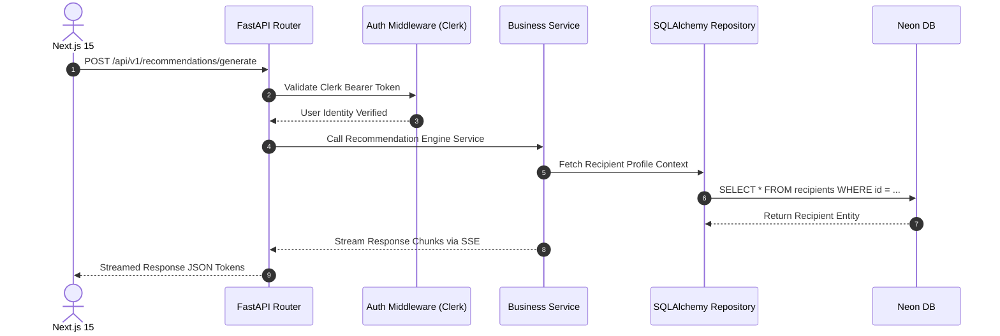
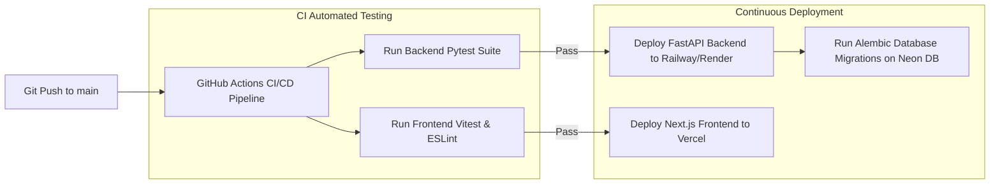

# System Architecture Blueprint (`SYSTEM_ARCHITECTURE.md`)
## AI-Powered Personalized Gift Recommendation Platform ("Presently")

---

## 1. High-Level Architecture & Data Flow

### 1.1 Enterprise System Topology

```mermaid
graph TD
    UserClient[Client Web Browser / Mobile] --> VercelEdge[Vercel Edge Network - Next.js 15 SSR/RSC]
    VercelEdge -->|REST API & SSE Stream| FastAPIGateway[Railway Backend - FastAPI Python 3.13]

    subgraph Auth & Security Layer
        FastAPIGateway -->|Validate JWT| ClerkAuth[Clerk Identity Provider]
    end

    subgraph Core Storage & Data Infrastructure
        FastAPIGateway -->|Async SQLAlchemy / asyncpg| NeonDB[(Neon Serverless PostgreSQL)]
        VercelEdge -->|Direct Upload Signed SDK| Cloudinary CDN[Cloudinary Media CDN]
    end

    subgraph AI Intelligence Engine
        FastAPIGateway -->|Async SSE Prompt Engine| OpenAI[OpenAI API - GPT-4o Engine]
    end
```

---

## 2. Monorepo Project Directory Structure

```
gift-platform/
├── frontend/                     # Next.js 15 Web Application
│   ├── src/
│   │   ├── app/                  # App Router Pages & Layouts
│   │   │   ├── (auth)/           # Clerk Auth Route Group
│   │   │   ├── (dashboard)/      # Authenticated Dashboard Group
│   │   │   ├── api/              # Route Handlers & SSE Proxies
│   │   │   ├── layout.tsx        # Global Root Layout
│   │   │   └── page.tsx          # Landing Page
│   │   ├── components/           # React UI Components
│   │   │   ├── ui/               # Shadcn UI Primitives
│   │   │   ├── survey/           # Survey Wizard Components
│   │   │   ├── recommendation/   # Gift Recommendation Cards
│   │   │   └── community/        # Social Feed Components
│   │   ├── lib/                  # Frontend Utilities & Axios Client
│   │   └── hooks/                # Custom React Hooks
│   ├── public/                   # Static Assets
│   └── package.json
│
├── backend/                      # FastAPI Python Application
│   ├── app/
│   │   ├── api/v1/endpoints/     # REST Controllers
│   │   ├── core/                 # App Settings & Security Middleware
│   │   ├── db/                   # Neon PostgreSQL Async Engine
│   │   ├── models/               # SQLAlchemy ORM Models
│   │   ├── schemas/              # Pydantic V2 Schemas
│   │   └── services/             # AI Engine & Business Services
│   ├── alembic/                  # Database Migrations
│   ├── main.py                   # FastAPI Application Entrypoint
│   └── requirements.txt
│
├── docs/                         # Architecture & Specification Docs
│   ├── PRD.md
│   ├── UI_UX_SPEC.md
│   ├── WIREFRAMES.md
│   ├── DATABASE_SCHEMA.md
│   ├── API_SPEC.md
│   └── SYSTEM_ARCHITECTURE.md
│
└── .github/
    └── workflows/                # CI/CD Pipelines (Deploy & Test)
```

---

## 3. Frontend Architecture (Next.js 15 & React 19)

### 3.1 Layout & State Management Strategy
* **App Router Structure**: Server Components (RSC) handle initial data fetching; Client Components (`"use client"`) handle interactive survey state and streaming.
* **Form & Validation Layer**: React Hook Form coupled with Zod validation schemas ensures client-side type-safe form execution before network dispatch.
* **State Management**: Local component state handles stepper inputs; Zustand / React Context manages global user preferences and toast notifications.

---

## 4. Backend Architecture (FastAPI & SQLAlchemy 2.0)

### 4.1 Request Pipeline & Dependency Injection
FastAPI handles asynchronous request routing using Python 3.13 `asyncio`.



---

## 5. AI Engine Architecture & Fallback Resilience

### 5.1 Prompt Engineering & Retry Circuit Breaker
1. **Prompt Scaffolding**: User parameters (relationship, OCEAN traits, budget, memories) are merged into a deterministic JSON-Schema system prompt.
2. **Streaming Execution**: OpenAI API called with `stream=True` and `response_format={"type": "json_object"}`.
3. **Resilience & Fallback**: If OpenAI returns HTTP 500/503 or times out (>8s), the service automatically falls back to secondary backup model endpoints with cached fallback product lookup tables.

---

## 6. Database Connection & Migration Lifecycle

* **Database Pooling**: FastAPI uses `asyncpg` engine connection pools (Min Pool: 5, Max Pool: 20) attached to Neon Serverless PostgreSQL.
* **Database Migrations**: Alembic manages schema version control. Migrations run in GitHub Actions prior to production deployment (`alembic upgrade head`).

---

## 7. Security Architecture & Threat Mitigation Matrix

| Security Vector | Implementation Mechanism |
|---|---|
| **Authentication** | Clerk JWT Bearer Token validation via `clerk-sdk-python`. |
| **Data Encryption** | TLS 1.3 in transit; AES-256 field-level encryption on recipient survey notes. |
| **SQL Injection** | Strict SQLAlchemy Async ORM parameterized queries. Zero raw SQL concatenation. |
| **XSS & CSRF** | Next.js automatic React JSX escaping + Strict CSP HTTP headers. |
| **Rate Limiting** | FastAPI `slowapi` rate limiter enforcing 10 requests / min on AI endpoints. |

---

## 8. Deployment Infrastructure & CI/CD Pipeline



---

## 9. Performance & Scalability Roadmap (100k -> 10M Users)

1. **Edge Caching**: Next.js 15 Route Cache & Vercel Edge CDN reduce database load on public pages.
2. **Vector Indexing**: Scaling to 10M products utilizes `pgvector` HNSW indexes for instant similarity searches.
3. **Asynchronous Background Workers**: Long-running email reminders and analytics exports offloaded to Celery / Redis background worker pools.

---

## 10. Deliverable Handover Statement

This System Architecture Blueprint (`SYSTEM_ARCHITECTURE.md`) completes the 6-phase engineering specifications for **Presently**. Full-stack developers can immediately proceed with workspace setup, frontend Next.js 15 initialization, FastAPI backend creation, and Neon DB integration.
