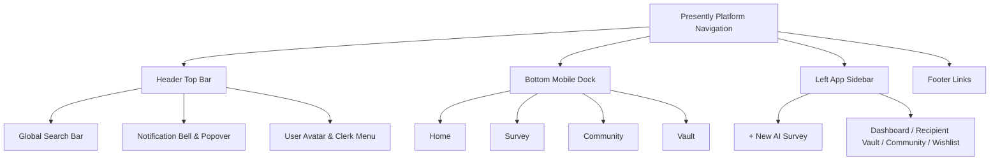
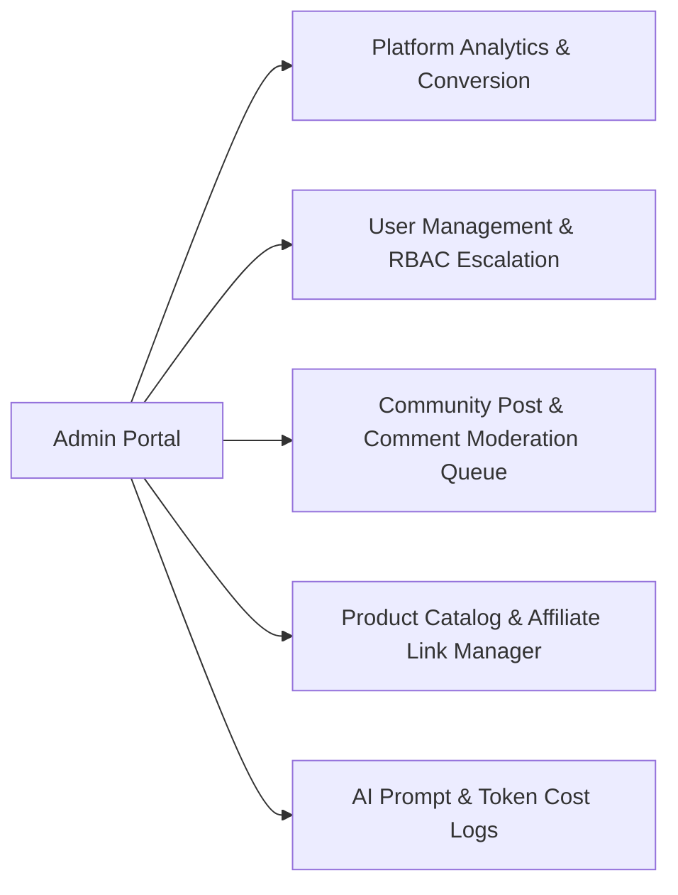

# UI/UX Design Specification (`UI_UX_SPEC.md`)
## AI-Powered Personalized Gift Recommendation Platform ("Presently")

---

## 1. Brand Identity

### 1.1 Brand Personality
`Presently` embodies five key personality traits:
* **Thoughtful & Empathetic**: Every interaction feels personal, understanding, and deeply tuned to human relationships.
* **Intelligent & Discerning**: AI recommendations feel like advice from a high-taste concierge, not a generic search engine.
* **Minimalist & Craft-Focused**: Inspired by Apple, Linear, and Notion—uncluttered typography, deliberate whitespace, and high tactile visual polish.
* **Delightful & Joyful**: Micro-interactions spark subtle moments of delight without overwhelming the visual hierarchy.
* **Trustworthy & Transparent**: Transparent affiliate disclaimers, clear data privacy controls, and verified community reviews build lasting consumer confidence.

### 1.2 Design Principles
1. **Clarity Over Clutter**: Primary user goals (e.g. running a survey, saving a gift) take precedence over secondary visual elements.
2. **Speed & Perception of Fluidity**: Skeleton loaders, optimistic UI updates, and streamed token animations reduce perceived wait times.
3. **Progressive Disclosure**: Show high-level insights first; allow users to expand into deep AI reasoning, product specs, or community comments on demand.
4. **Context-Aware Sentiment**: Dynamic UI themes subtly shift accent highlights based on recipient relation and occasion tone (e.g. warm rose accents for anniversaries, sleek violet for corporate milestones).
5. **Universal Accessibility**: Accessible color contrast, keyboard-navigable dialogs, and screen-reader compliant aria markers built-in from day one.

### 1.3 Tone of Voice
* **Headline Style**: Warm, confident, concise ("Gift giving, elevated", "Find the gift that speaks without words").
* **Help & Microcopy**: Friendly, encouraging, clear ("Tell us a little about Alex", "We're matching recipient parameters...").
* **Error Messaging**: Constructive, empathetic, solution-focused ("We couldn't connect to our AI engine. Retrying in 3 seconds...").

### 1.4 Visual Identity & Logo Direction
* **Logo Concept**: A minimalist geometric mark combining a stylized ribbon node with a sparkling spark icon, representing the union of human appreciation and artificial intelligence.
* **Brand Mark Grid**: Built on an isometric grid using 2px precise stroke vectors.
* **Icon Style**: Custom Lucide-react line icons with a uniform 1.5px stroke weight, rounded joints, and consistent 24x24 bounding boxes.

---

## 2. Design System Architecture

### 2.1 Color Palette & CSS Variables

```css
:root {
  /* Surface & Base Colors (Light Theme) */
  --bg-app: #FAFAFA;                /* Light background */
  --bg-surface: #FFFFFF;            /* Surface card background */
  --bg-surface-subtle: #F4F4F5;     /* Subtle container background */
  
  /* Text & Content Tokens */
  --text-primary: #09090B;          /* Obsidian primary text */
  --text-secondary: #71717A;        /* Zinc-500 secondary text */
  --text-tertiary: #A1A1AA;         /* Zinc-400 disabled text */

  /* Brand Primary & Accents */
  --brand-primary: #18181B;        /* Linear dark obsidian */
  --brand-primary-fg: #FAFAFA;
  --accent-violet: #6366F1;         /* Indigo-500 primary AI accent */
  --accent-rose: #F43F5E;           /* Rose-500 sentimental accent */
  --accent-emerald: #10B981;        /* Emerald-500 success & price highlight */

  /* System Feedback Colors */
  --state-success: #10B981;
  --state-warning: #F59E0B;
  --state-error: #EF4444;
  --state-info: #3B82F6;

  /* Borders & Dividers */
  --border-subtle: #E4E4E7;
  --border-strong: #D4D4D8;
  --ring-focus: rgba(99, 102, 241, 0.4);

  /* Shadows & Elevation */
  --shadow-sm: 0 1px 2px 0 rgba(0, 0, 0, 0.05);
  --shadow-md: 0 4px 6px -1px rgba(0, 0, 0, 0.07), 0 2px 4px -1px rgba(0, 0, 0, 0.04);
  --shadow-lg: 0 10px 15px -3px rgba(0, 0, 0, 0.1), 0 4px 6px -2px rgba(0, 0, 0, 0.05);
  --shadow-glow: 0 0 25px -5px rgba(99, 102, 241, 0.25);
}

.dark {
  /* Surface & Base Colors (Dark Theme) */
  --bg-app: #09090B;                /* Deep charcoal dark background */
  --bg-surface: #18181B;            /* Obsidian card background */
  --bg-surface-subtle: #27272A;     /* Zinc-800 container background */

  /* Text & Content Tokens */
  --text-primary: #FAFAFA;          /* Crisp light text */
  --text-secondary: #A1A1AA;        /* Zinc-400 secondary text */
  --text-tertiary: #71717A;         /* Zinc-500 disabled text */

  /* Brand Primary & Accents */
  --brand-primary: #FAFAFA;
  --brand-primary-fg: #09090B;
  --accent-violet: #818CF8;         /* Indigo-400 primary AI accent */
  --accent-rose: #FB7185;           /* Rose-400 sentimental accent */
  --accent-emerald: #34D399;        /* Emerald-400 success */

  /* Borders & Dividers */
  --border-subtle: #27272A;
  --border-strong: #3F3F46;
  --ring-focus: rgba(129, 140, 248, 0.5);

  /* Glassmorphism Surface Overlay */
  --glass-bg: rgba(24, 24, 27, 0.75);
  --glass-border: rgba(255, 255, 255, 0.1);
  --shadow-glow: 0 0 30px -5px rgba(129, 140, 248, 0.3);
}
```

### 2.2 Typography Scale & Font System
* **Primary Sans-Serif Font**: `Inter` (or `Outfit` for display headings) via `next/font/google`.

| Token | Font Size | Line Height | Weight | Usage |
|---|---|---|---|---|
| `display-xl` | 3.75rem (60px) | 1.1 | 700 Bold | Landing page main hero |
| `display-lg` | 3.00rem (48px) | 1.15 | 700 Bold | Section titles, feature hero |
| `heading-1` | 2.25rem (36px) | 1.2 | 600 SemiBold | Page titles (Dashboard, Results) |
| `heading-2` | 1.50rem (24px) | 1.3 | 600 SemiBold | Section headings, Card headers |
| `heading-3` | 1.25rem (20px) | 1.4 | 500 Medium | Subheadings, Modal headers |
| `body-lg` | 1.125rem (18px) | 1.5 | 400 Regular | Lead paragraphs, hero copy |
| `body-md` | 1.00rem (16px) | 1.5 | 400 Regular | Standard body text, form inputs |
| `body-sm` | 0.875rem (14px) | 1.4 | 400 Regular | Secondary descriptions, cards |
| `caption` | 0.75rem (12px) | 1.3 | 500 Medium | Badges, timestamps, footnotes |

### 2.3 Spacing System (8px Baseline Grid)
`4px (0.5)` | `8px (1)` | `12px (1.5)` | `16px (2)` | `24px (3)` | `32px (4)` | `48px (6)` | `64px (8)` | `96px (12)`

### 2.4 Component Design Standards (Shadcn/UI Customization)
* **Border Radius**: 
  * Buttons & Inputs: `rounded-lg` (8px)
  * Cards & Modals: `rounded-xl` (12px)
  * Badges & Chips: `rounded-full` (9999px)
* **Buttons**:
  * `Primary`: Solid obsidian/white fill with subtle shadow and `whileTap={{ scale: 0.98 }}`.
  * `Secondary`: Bordered subtle zinc surface with hover background shift.
  * `Ghost`: No border, subtle zinc hover backdrop.
  * `AI Gradient`: Radial gradient border with violet glowing ring during generation.
* **Inputs & Forms**:
  * Height: 44px (`h-11`) for optimal touch targets.
  * Focus state: `ring-2 ring-indigo-500/40 border-indigo-500 transition-all duration-200`.

---

## 3. Responsive Layout Breakpoints

| Breakpoint Tag | Minimum Width | Target Devices | Layout Behavior & Grid Columns |
|---|---|---|---|
| `sm` | 640px | Mobile (Portrait & Landscape) | Single column layout, full-width drawers, bottom tab bar. |
| `md` | 768px | Tablets (Portrait) | 2-column card grid, collapsible sidebar overlay. |
| `lg` | 1024px | Laptops / Tablets (Landscape) | 3-column recommendation grid, fixed left navigation sidebar. |
| `xl` | 1280px | Desktops | 4-column feed grid, dual sticky sidebars (Nav + AI Assistant). |
| `2xl` | 1536px+ | Large Desktop Monitors | Max container width `max-w-7xl` centered with wide margins. |

---

## 4. Navigation Architecture

### 4.1 Navigation Elements Summary



---

## 5. Comprehensive Page Specifications (24 Pages)

### 5.1 Landing Page (`/`)
* **Purpose**: Convert visitors into active AI survey runners and registered users.
* **Layout**: Full-width hero, bento box features grid, live recommendation card preview, community carousel.
* **Components**: `Navbar`, `HeroSection`, `DemoSurveyCard`, `FeatureBento`, `TestimonialCarousel`, `Footer`.
* **User Actions**: Click "Find a Gift in 2 Mins", try interactive instant prompt box, explore trending community ideas.
* **States**:
  * *Loading*: Skeleton glow on hero preview card.
  * *Error*: Graceful fallback if live stats API fails.

### 5.2 Login Page (`/login`)
* **Purpose**: Authenticate returning users via Clerk UI.
* **Layout**: Centered card layout with glassmorphic backdrop.
* **Components**: `ClerkSignInWidget`, `BrandLogoHeader`, `OAuthButtonList`.

### 5.3 Sign Up Page (`/signup`)
* **Purpose**: Register new user accounts with social OAuth (Google, Apple) or email.
* **Layout**: Dual-pane layout (Left: Brand testimonial visual, Right: Clerk SignUp form).

### 5.4 Forgot Password Page (`/forgot-password`)
* **Purpose**: Trigger password reset email workflow via Clerk.

### 5.5 User Dashboard (`/dashboard`)
* **Purpose**: Central command center showing upcoming occasion reminders, saved recipient profiles, and recent AI recommendations.
* **Layout**: Dual-column layout (Main: Occasion Timeline + Recent Surveys, Right Sidebar: Recommended Trending Gifts).
* **Components**: `OccasionBanner`, `RecipientAvatarRow`, `RecommendationHistoryGrid`, `QuickSurveyCTA`.
* **Empty State**: Friendly graphic with "No saved recipients yet. Create your first profile!".

### 5.6 AI Survey Page (`/survey`)
* **Purpose**: Multi-step wizard collecting detailed recipient traits.
* **Layout**: Centered multi-step form with Framer Motion slide transitions and fixed sticky bottom navigation bar (Back / Next / Generate).
* **Components**: `StepProgressGauge`, `RelationshipSelector`, `OCEANSliderGroup`, `BudgetRangeSlider`, `MemoryNotesTextArea`.
* **Loading State**: Animated full-screen AI Concierge overlay ("Synthesizing personality traits...").

### 5.7 AI Recommendation Results Page (`/recommendations/[id]`)
* **Purpose**: Display AI-recommended gifts with personalized reasoning, match scores, and direct buy links.
* **Layout**: Sticky top summary bar + 3-column responsive card grid.
* **Components**: `MatchScoreBadge`, `AIReasoningAccordion`, `AffiliateBuyButton`, `CompareCheckbox`, `SaveToWishlistButton`.
* **User Actions**: Filter by price, trigger side-by-side comparison, click outbound buy link, share wishlist.

### 5.8 Community Feed Page (`/community`)
* **Purpose**: Social feed of user-shared gift stories and unboxing experiences.
* **Layout**: Masonry or 3-column feed grid with sticky top category tabs.
* **Components**: `CommunityPostCard`, `UpvoteButton`, `CommentCountBadge`, `CategoryPillList`.

### 5.9 Community Post Details Page (`/community/[id]`)
* **Purpose**: In-depth view of a specific gift story with full markdown comments.
* **Layout**: 2-Column layout (Left: Unboxing photos + story text, Right: Linked gift item card + purchase button).

### 5.10 Create Community Post Page (`/community/create`)
* **Purpose**: Allow users to share a gift idea with photos, tags, and story notes.
* **Components**: `ImageUploaderCloudinary`, `ProductTagInput`, `RichTextEditor`.

### 5.11 Categories Page (`/categories`)
* **Purpose**: Browse gift ideas by taxonomy (Tech, Home, Experiences, Fashion, Handcrafted).

### 5.12 Search Results Page (`/search?q=...`)
* **Purpose**: Surface matching gift items, recipient profiles, and community posts.

### 5.13 Wishlist Page (`/wishlist`)
* **Purpose**: Manage user-saved gifts in organized custom collections.

### 5.14 Saved Surveys Page (`/surveys/saved`)
* **Purpose**: Archive of past survey inputs allowing instant re-generation.

### 5.15 Notifications Page (`/notifications`)
* **Purpose**: List upcoming birthday alerts, comment replies, and system updates.

### 5.16 User Profile Page (`/profile/[username]`)
* **Purpose**: Public profile showcasing user's public gift collections and community posts.

### 5.17 Settings Page (`/settings`)
* **Purpose**: Manage account credentials, display currency, theme preference (Light/Dark), and email reminder frequency.

### 5.18 Help Center Page (`/help`)
* **Purpose**: Searchable FAQ on how the AI matching algorithm works and affiliate link disclosures.

### 5.19 Contact Page (`/contact`)
* **Purpose**: Contact form for customer support and merchant partner inquiries.

### 5.20 About Page (`/about`)
* **Purpose**: Brand mission story, team overview, and AI ethics statement.

### 5.21 Privacy Policy Page (`/privacy`)
* **Purpose**: Comprehensive GDPR/CCPA data privacy compliance statement.

### 5.22 Terms & Conditions Page (`/terms`)
* **Purpose**: Platform terms of service and affiliate link disclosure policy.

### 5.23 404 Error Page (`/404`)
* **Purpose**: Custom humorous 404 page ("Looks like this gift was unboxed somewhere else!").

### 5.24 500 Error Page (`/500`)
* **Purpose**: System error screen with an automatic retry button and status update link.

---

## 6. Admin Dashboard Specifications



### 6.1 Admin Feature Modules
1. **Analytics Dashboard**: Real-time charts (Recharts) showing survey completion velocity, affiliate link CTR, and API token expenditure.
2. **Community Moderation Queue**: Flagged posts approval/rejection queue with one-click user warnings or content suppression.
3. **Gift Catalog Manager**: CRUD table for adding curated merchant items and managing affiliate tag parameters.
4. **AI Prompt Inspector**: Telemetry log showing prompt latencies, token consumption, and model execution flags.

---

## 7. Reusable Component Library Specifications

### 7.1 Key Component Specifications

| Component Name | Props / Interface | Visual Spec & Behavior |
|---|---|---|
| `Navbar` | `user?: User, activeRoute: string` | Sticky top glassmorphic bar (`backdrop-blur-md`), brand logo, search bar, Clerk user button. |
| `GiftCard` | `item: GiftItem, onSave: fn, onCompare: fn` | Glass card with rounded-xl border, image thumbnail with hover zoom scale 1.05, match score pill badge, price tag, buy button. |
| `AIReasoningAccordion` | `reasoning: string, strategy: string` | Collapsible Shadcn accordion displaying bullet points explaining why the item fits recipient traits. |
| `OCEANSlider` | `trait: string, value: number, onChange: fn` | Dual-tone slider with dynamic label tooltips showing psychometric extreme tags (e.g. Introverted $\leftrightarrow$ Extraverted). |
| `CommunityPostCard` | `post: PostData, onLike: fn` | Social card with author avatar, image carousel, product tag pills, threaded comment toggle button. |
| `AIChatWidget` | `recipientContext: RecipientData` | Floating bottom-right drawer for live refinement chat ("Show me cheaper options"). |

---

## 8. Micro-Interactions & Animation Guidelines (Framer Motion)

### 8.1 Animation Specifications
* **Page Transitions**: Smooth fade-in & slide-up (`initial={{ opacity: 0, y: 12 }} animate={{ opacity: 1, y: 0 }} transition={{ duration: 0.25, ease: "easeOut" }}`).
* **Button Hover States**: Subtle spring lift (`whileHover={{ scale: 1.02, y: -1 }} whileTap={{ scale: 0.98 }}`).
* **Card Staggering**: Grid container stagger children by 0.05s intervals for dynamic load-in sequence.
* **AI Concierge Pulsing**: Radial glowing halo ring around the loading avatar during streamed LLM response parsing.

---

## 9. Accessibility Specifications (WCAG 2.1 AA)

1. **Color Contrast Ratio**: Minimum 4.5:1 for standard body text; 3:1 for large display headers against both dark and light backdrops.
2. **Keyboard Navigation**: Full focus ring indicator visibility (`ring-2 ring-indigo-500 focus-visible:outline-none`) on all interactive buttons, cards, and input fields.
3. **Screen Reader ARIA**: Form inputs tied explicitly to `<label>` elements; streamed AI outputs wrapped in `aria-live="polite"` regions.
4. **Reduced Motion**: Respect `prefers-reduced-motion` CSS media query by automatically disabling spring transitions for motion-sensitive users.

---

## 10. Dark & Light Theme Implementation Strategy

* **Theme Switching**: Managed via `next-themes` provider storing preference in LocalStorage + User Profile setting.
* **Zero FOUC (Flash of Unstyled Content)**: Injected inline script setting `.dark` class before DOM render.
* **Glassmorphic Surface Adaptation**:
  * Light Mode: `bg-white/80 border-zinc-200/60 shadow-sm backdrop-blur-md`
  * Dark Mode: `bg-zinc-900/80 border-zinc-800/60 shadow-glow backdrop-blur-md`

---

## 11. User Experience Guidelines & Trust Signals

1. **Progressive Disclosure**: Keep initial survey questions visually lightweight; expand advanced fine-tuning (OCEAN sliders, memory text) only when requested.
2. **Transparent Affiliate Disclosure**: Every buy button includes an explicit tooltip ("Purchasing through our verified partner links supports Presently at zero extra cost to you").
3. **Data Protection Assurance**: Recipient survey inputs feature clear lock badges indicating field encryption.

---

## 12. Deliverable Handover Statement

This UI/UX Specification Document (`UI_UX_SPEC.md`) provides complete design system tokens, responsive layout rules, page hierarchy specs, and animation parameters ready for immediate execution by Next.js 15 and Tailwind CSS frontend engineering teams.
