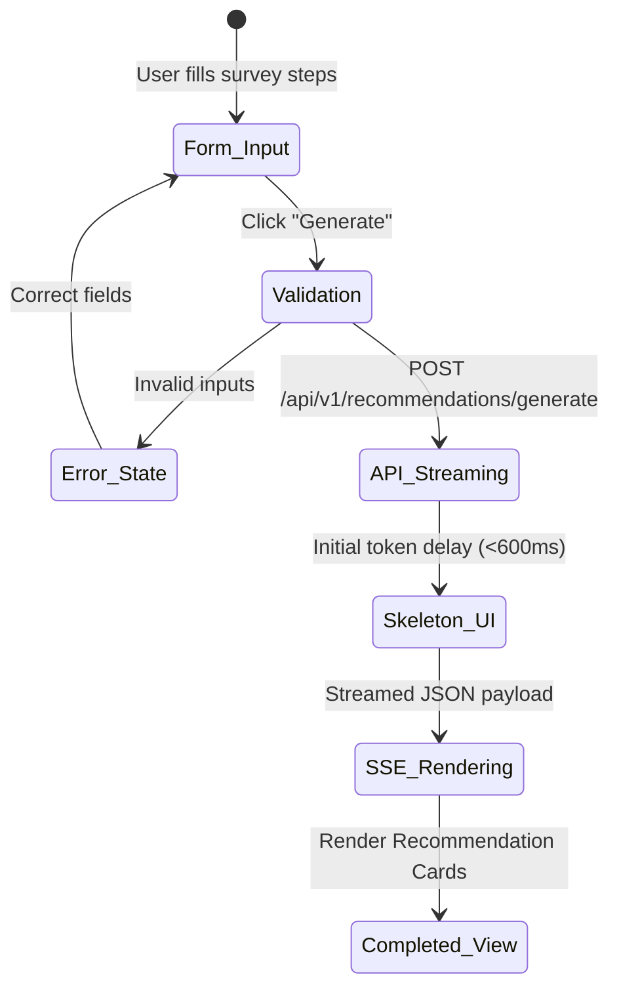

# Wireframes & User Flow Architecture (`WIREFRAMES.md`)
## AI-Powered Personalized Gift Recommendation Platform ("Presently")

---

## 1. Information Architecture (IA)

### 1.1 Complete Site Map & App Hierarchy

```mermaid
graph TD
    Root[Presently Platform Root] --> PublicGroup[1. Public Unauthenticated]
    Root --> AuthGroup[2. Authentication Engine]
    Root --> UserGroup[3. Authenticated App]
    Root --> AdminGroup[4. Admin Console]

    %% Public Pages
    PublicGroup --> Landing["/ (Landing Page)"]
    PublicGroup --> About["/about"]
    PublicGroup --> Contact["/contact"]
    PublicGroup --> FAQ["/faq"]
    PublicGroup --> Privacy["/privacy"]
    PublicGroup --> Terms["/terms"]

    %% Auth Pages
    AuthGroup --> Login["/login (Clerk)"]
    AuthGroup --> Register["/register (Clerk)"]
    AuthGroup --> ForgotPass["/forgot-password"]
    AuthGroup --> EmailVerify["/verify-email"]

    %% Authenticated App Pages
    UserGroup --> Dashboard["/dashboard"]
    UserGroup --> Survey["/survey (Wizard)"]
    UserGroup --> SurveyResults["/surveys/[id]"]
    UserGroup --> Recommendations["/recommendations/[id]"]
    UserGroup --> RecDetail["/recommendations/[id]/items/[itemId]"]
    UserGroup --> Community["/community"]
    UserGroup --> PostDetail["/community/[id]"]
    UserGroup --> CreatePost["/community/create"]
    UserGroup --> Categories["/categories"]
    UserGroup --> Search["/search"]
    UserGroup --> Wishlist["/wishlist"]
    UserGroup --> SavedSurveys["/surveys/saved"]
    UserGroup --> Notifications["/notifications"]
    UserGroup --> Profile["/profile/[username]"]
    UserGroup --> Settings["/settings"]

    %% Admin Console Pages
    AdminGroup --> AdminDash["/admin"]
    AdminGroup --> AdminAnalytics["/admin/analytics"]
    AdminGroup --> AdminUsers["/admin/users"]
    AdminGroup --> AdminPosts["/admin/posts"]
    AdminGroup --> AdminGifts["/admin/gifts"]
    AdminGroup --> AdminReports["/admin/reports"]
    AdminGroup --> AdminSettings["/admin/settings"]
```



---

## 2. Detailed User Flow Journeys (12 Key Flows)

### Journey 1: Guest User Instant Demo Survey Flow
* **Entry Point**: Landing Page (`/`).
* **User Action**: Click "Find a Gift in 2 Mins" primary CTA button.
* **System Response**: Render Step 1 of Guest Survey Wizard (`/survey?mode=demo`).
* **Success Flow**: User completes 4 steps $\rightarrow$ AI generates 3 preview recommendations $\rightarrow$ Modal prompts Clerk Sign-Up to unmask remaining items and save results.
* **Error Flow**: Missing required fields $\rightarrow$ Form highlights invalid fields with red border and screen-reader alert.

### Journey 2: New User Registration & Onboarding
* **Entry Point**: Click "Sign Up" header button or registration lock modal.
* **User Action**: Complete Clerk Social OAuth (Google/Apple) or Email + Password.
* **System Response**: Redirect to `/dashboard?onboarding=true` with welcomed confetti micro-animation.
* **Next Page**: Dashboard with pre-populated sample recipient card ("Add your first recipient").

### Journey 3: Returning User Login
* **Entry Point**: `/login`.
* **User Action**: Submit Clerk credentials.
* **System Response**: Authenticate JWT $\rightarrow$ Verify active session $\rightarrow$ Redirect to `/dashboard`.

### Journey 4: Taking a Gift Survey
* **Entry Point**: Dashboard button (`+ New AI Survey`).
* **User Action**: Select existing recipient profile or create new one $\rightarrow$ Set budget range ($50-$150) $\rightarrow$ Move OCEAN sliders $\rightarrow$ Type memory notes $\rightarrow$ Click "Generate Gift Ideas".
* **System Response**: Show AI Concierge pulse overlay $\rightarrow$ Stream recommendations real-time over SSE (Server-Sent Events).
* **Next Page**: `/recommendations/[id]`.

### Journey 5: Receiving AI Recommendations & Outbound Purchase
* **Entry Point**: `/recommendations/[id]`.
* **User Action**: Expand "Why this is perfect" reasoning accordion $\rightarrow$ Click "Buy on Amazon" affiliate button.
* **System Response**: Log affiliate outbound click metric $\rightarrow$ Open merchant link in new tab.

### Journey 6: Saving Gifts to Wishlist
* **Entry Point**: Recommendation Card or Community Post Card.
* **User Action**: Click Bookmark Icon $\rightarrow$ Select Wishlist target folder ("Anniversary 2026").
* **System Response**: Optimistic UI bookmark icon fill $\rightarrow$ Toast notification ("Saved to Anniversary 2026").

### Journey 7: Creating a Wishlist Collection
* **Entry Point**: `/wishlist`.
* **User Action**: Click "+ Create Collection" $\rightarrow$ Type title "Mom's 60th Birthday" $\rightarrow$ Set to Public or Private.
* **System Response**: Create wishlist entity in Neon DB $\rightarrow$ Display new empty card slot.

### Journey 8: Uploading Community Posts
* **Entry Point**: `/community/create`.
* **User Action**: Upload unboxing photo (Cloudinary widget) $\rightarrow$ Tag product $\rightarrow$ Write story notes $\rightarrow$ Publish.
* **System Response**: Validate content safety guardrails $\rightarrow$ Publish to `/community` feed $\rightarrow$ Show success toast.

### Journey 9: Browsing & Interacting with Community Ideas
* **Entry Point**: `/community`.
* **User Action**: Scroll infinite feed $\rightarrow$ Click Upvote button $\rightarrow$ Expand comment box $\rightarrow$ Post comment.
* **System Response**: Increment like counter optimistically $\rightarrow$ Append comment in real-time.

### Journey 10: Searching Gifts & Filtering
* **Entry Point**: Top Navigation Global Search Bar.
* **User Action**: Type "Coffee grinder" $\rightarrow$ Select filter "Under $100".
* **System Response**: Execute vector/text search API $\rightarrow$ Render matching gift catalog items & community stories.

### Journey 11: Updating Profile & Preferences
* **Entry Point**: `/settings`.
* **User Action**: Toggle Dark/Light mode theme $\rightarrow$ Change default currency to EUR $\rightarrow$ Click Save.
* **System Response**: Persist to DB $\rightarrow$ Next-themes instant visual switch.

### Journey 12: Administrator Moderation Workflow
* **Entry Point**: `/admin/posts`.
* **User Action**: Review flagged community post in moderation queue $\rightarrow$ Click "Approve" or "Suppress".
* **System Response**: Update post status $\rightarrow$ Notify reporting user of moderation resolution.

---

## 3. Comprehensive Page Wireframe Specifications (33 Views)

Below are structural ASCII wireframes and layout specifications for every primary page.

### 3.1 Landing Page (`/`)

```
+-----------------------------------------------------------------------------------+
| [Logo] Presently     [Search...]   Community  Categories  Pricing   [Sign In] [Start] |
+-----------------------------------------------------------------------------------+
|                                                                                   |
|                      GIFT GIVING, REIMAGINED BY AI.                              |
|          Stop guessing. Discover hyper-personalized gifts tailored to             |
|          relationship dynamics, personality traits, and real memories.            |
|                                                                                   |
|                    [ + Find a Gift in 2 Mins ]   [ Watch Demo ]                    |
|                                                                                   |
| +-------------------------------------------------------------------------------+ |
| | LIVE AI PREVIEW CARD                                                          | |
| | Recipient: Sarah (Partner) | Occasion: Anniversary | Budget: $50-$150         | |
| | [Img] Fellow Stagg EKG Kettle - Match Score: 96%                              | |
| | "Perfect for Sarah's morning pour-over ritual and minimalist kitchen aesthetic"| |
| +-------------------------------------------------------------------------------+ |
+-----------------------------------------------------------------------------------+
| BENTO FEATURE GRID                                                                |
| +-----------------------+ +-----------------------+ +---------------------------+ |
| | Psychometric Survey   | | Community Verification | | Occasion Vault Reminders  | |
| +-----------------------+ +-----------------------+ +---------------------------+ |
+-----------------------------------------------------------------------------------+
| FOOTER: [Links] [Terms] [Privacy] [Socials]                     © 2026 Presently  |
+-----------------------------------------------------------------------------------+
```

* **Purpose**: Primary marketing funnel & instant interactive demo conversion.
* **Header / Nav**: Sticky glass bar, brand logo, search bar, sign-in CTA button.
* **Main Content**: Hero headline, action CTAs, live interactive demo card, Bento feature grid, community unwrapping carousel.
* **Responsive Behavior**: Mobile stacks hero elements vertically; desktop displays full bento grid.

### 3.2 Survey Wizard Page (`/survey`)

```
+-----------------------------------------------------------------------------------+
| [Logo] Presently                                                [Step 2 of 4]  [X]|
+-----------------------------------------------------------------------------------+
|                     STEP 2: PERSONALITY & TASTE PROFILE                           |
|                                                                                   |
| How would you describe your recipient's visual & practical taste?                 |
|                                                                                   |
|  MINIMALIST  [===========o==========]  MAXIMALIST                                |
|  PRACTICAL   [======o===============]  WHIMSICAL                                 |
|  ANALOG      [=================o====]  TECH-FOCUSED                              |
|                                                                                   |
| Selected Hobbies & Interests:                                                     |
| [ Specialty Coffee x ] [ Vintage Photography x ] [ Hiking x ] [ + Add Tag ]       |
|                                                                                   |
| Specific Memories or Preferences (Optional):                                      |
| +-------------------------------------------------------------------------------+ |
| | She loves Ethiopian Yirgacheffe beans and owns a Leica vintage film camera... | |
| +-------------------------------------------------------------------------------+ |
|                                                                                   |
|                           [ < Back ]    [ Next Step > ]                           |
+-----------------------------------------------------------------------------------+
```

* **Purpose**: Capture granular recipient parameters.
* **Layout**: Centered container (`max-w-2xl`), step progress bar at top, sticky action buttons at bottom.
* **States**:
  * *Loading*: Full-screen AI Concierge overlay with animated glowing ring.
  * *Error*: Form field inline alert badge if required selection is missing.

### 3.3 AI Recommendation Results Page (`/recommendations/[id]`)

```
+-----------------------------------------------------------------------------------+
| [< Dashboard]   For Sarah • Partner • Anniversary • $50-$150    [Share] [PDF]     |
+-----------------------------------------------------------------------------------+
| FILTER BAR: Sort by: [ Match Score v ]  Price: [ All v ]  Retailer: [ Amazon v ]  |
+-----------------------------------------------------------------------------------+
|                                                                                   |
| +-------------------------+ +-------------------------+ +-----------------------+ |
| | MATCH 96%    [Bookmark] | | MATCH 92%    [Bookmark] | | MATCH 88%  [Bookmark] | |
| | [ Product Image ]       | | [ Product Image ]       | | [ Product Image ]     | |
| | Fellow Stagg Kettle     | | Leica Leather Strap     | | Ethiopian Bean Sub    | |
| | $165.00 • Amazon        | | $75.00 • Etsy           | | $45.00 • Trade Coffee | |
| |                         | |                         | |                       | |
| | v Why this is perfect   | | v Why this is perfect   | | v Why this is perfect | |
| | • Matches pour-over habit| | • Fits Leica camera body| | • Fresh Ethiopian roast| |
| |                         | |                         | |                       | |
| | [  Buy on Amazon ->  ]  | | [  Buy on Etsy ->   ]   | | [  Buy on Trade ->  ] | |
| +-------------------------+ +-------------------------+ +-----------------------+ |
|                                                                                   |
+-----------------------------------------------------------------------------------+
```

* **Purpose**: Display AI results with actionable purchase links and rationale.
* **Layout**: Sticky top parameter chip bar, 3-column responsive card grid.
* **Components**: `MatchScoreBadge`, `AIReasoningAccordion`, `AffiliateBuyButton`, `CompareCheckbox`.

### 3.4 Community Feed Page (`/community`)

```
+-----------------------------------------------------------------------------------+
| [Sidebar Nav] | COMMUNITY GIFT IDEAS & UNBOXINGS            [+ Share Gift Idea]   |
| Dashboard     | Tabs: [ Trending ] [ Editor's Picks ] [ Christmas ] [ Couples ]   |
| Survey        |-------------------------------------------------------------------|
| Community     | +---------------------------------------------------------------+ |
| Wishlist      | | [Avatar] Elena R. shared a gift for "Husband - 30th Birthday" | |
| Vault         | | [ Image Carousel: Custom Mechanical Keyboard Unboxing ]       | |
| Settings      | | Keychron Q1 Custom Coiled Cable & Artisan Keycaps - $210      | |
|               | | "He was blown away! He spends 8 hours typing every day..."    | |
|               | | [ ▲ Upvote (142) ]   [ 💬 Comments (18) ]   [ 🔖 Save Idea ] | |
|               | +---------------------------------------------------------------+ |
+-----------------------------------------------------------------------------------+
```

---

## 4. Navigation & Deep Linking Map

### 4.1 Global Navigation Hierarchy Matrix

| From Page | To Target Page | Interaction Mechanism | Deep Link Parameters |
|---|---|---|---|
| Landing Page | Survey Wizard | Click "Find a Gift in 2 Mins" | `/survey?mode=demo` |
| Survey Wizard | Recommendations | Click "Generate Gift Ideas" | `/recommendations/[recommendation_id]` |
| Recommendation | Outbound Merchant | Click "Buy on Amazon" | `/outbound?item_id=...&aff_id=...` |
| Community Feed | Post Details | Click Post Card | `/community/[post_id]` |
| Dashboard | Recipient Vault | Click Recipient Chip | `/dashboard?recipient_id=...` |
| Any Page | Search Results | Type in Global Search Bar | `/search?q=coffee` |

---

## 5. Reusable Component Placement Grid

| Component Name | Header | Sidebar | Main Canvas | Drawer / Modal | Footer |
|---|:---:|:---:|:---:|:---:|:---:|
| `Navbar` | ✅ | ❌ | ❌ | ❌ | ❌ |
| `GlobalSearchBar` | ✅ | ❌ | ✅ | ❌ | ❌ |
| `AppSidebar` | ❌ | ✅ | ❌ | ❌ | ❌ |
| `SurveyStepCard` | ❌ | ❌ | ✅ | ❌ | ❌ |
| `RecommendationCard`| ❌ | ❌ | ✅ | ❌ | ❌ |
| `CommunityPostCard` | ❌ | ❌ | ✅ | ❌ | ❌ |
| `AIChatWidget` | ❌ | ❌ | ❌ | ✅ (Floating) | ❌ |
| `ToastNotification` | ❌ | ❌ | ❌ | ✅ (Overlay) | ❌ |

---

## 6. Responsive Layout Transformations

### 6.1 Breakpoint Adaptation Rules
* **Mobile (<640px)**: 
  * Left sidebar converts into a bottom mobile navigation dock (Home, Survey, Community, Vault).
  * 3-column recommendation grids collapse into a single vertical scrolling card stack.
  * Modals convert to slide-up full-screen drawers.
* **Tablet (640px - 1024px)**:
  * 2-column card grid display. Collapsible top hamburger navigation.
* **Desktop (1024px+)**:
  * Fixed left sidebar (`w-64`), 3 or 4-column responsive masonry grids, floating AI refinement widget.

---

## 7. Comprehensive Interaction Flow Diagrams

### 7.1 AI Survey Generation State Machine



---

## 8. UX Best Practices & Trust Signals

1. **Vercel-Grade Performance**: Optimistic UI rendering on like/bookmark actions with instant zero-latency feedback.
2. **Linear-Style Hotkeys**: Keyboard shortcuts (`Cmd+K` for global search, `Cmd+N` for new survey).
3. **Apple-Inspired Polish**: Subtle spring physics on card hovers and glassmorphic translucent surfaces.
4. **Trust Signals**: Verified Gifter badges on community reviews, explicit affiliate disclosures, and transparent AI reasoning breakdowns.

---

## 9. Deliverable Handover Statement

This Wireframes & User Flow Document (`WIREFRAMES.md`) serves as the definitive structural blueprint for UI designers and Next.js 15 frontend developers implementing **Presently**.
